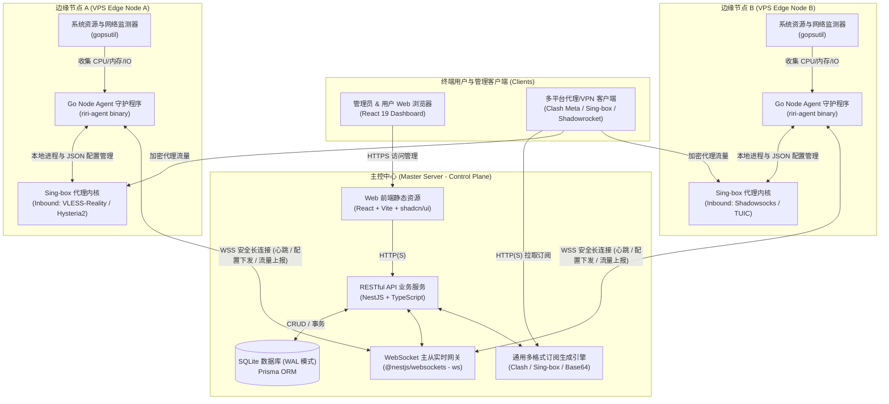

# RiriCloud (哩哩云)

<div align="center">

**现代化的多节点分布式 VPN / 代理管理系统**  
*极简架构 · 零外部依赖 · WSS 毫秒级长连接 · 现代协议支持 · 多格式订阅统一输出*

[](./CHANGELOG.md)
[](https://nodejs.org)
[](https://pnpm.io)
[](https://go.dev)
[](https://nestjs.com)
[](https://react.dev)
[](https://prisma.io)
[](#)

[✨ 核心特性](#-核心特性) • [📐 系统架构](#-系统架构) • [🛠️ 技术栈](#️-技术栈) • [🚀 快速开始](#-快速开始) • [📦 生产部署](#-生产部署) • [📂 目录结构](#-目录结构) • [📚 官方文档库](#-官方设计与技术文档)

</div>

---

## 📖 项目简介

**RiriCloud** 是一个专为个人与团队设计的高性能、分布式代理纳管系统。告别传统面板对 MySQL/Redis 等繁重中间件的依赖，RiriCloud 采用清晰的 **Master-Agent（控制平面与数据平面解耦）** 架构设计：

- **主控端 (Master Server & Web Dashboard)**：基于 **NestJS + React + SQLite (WAL 模式)** 构建，单进程开箱即用，提供极简运维与流畅的现代化管理后台。
- **边缘节点端 (Edge Node Agent)**：基于 **Go** 编写的轻量单静态守护二进制（`riri-agent`），托管 **Sing-box** 代理内核，通过 **WebSocket over TLS (WSS)** 与主控端保持全双工长连接，实现毫秒级配置热推与实时遥测心跳上报。
- **客户端通用订阅**：一套订阅引擎无缝输出 Clash Meta (Mihomo)、Sing-box 官方配置及通用 Base64/URI 链接，支持流量限额与到期时间自动管控。

---

## ✨ 核心特性

- 🪶 **极简部署与零中间件依赖**：主控端内置 SQLite（WAL 高并发读写模式）+ Prisma ORM，彻底摒弃 Redis、MySQL、MQ 等外部依赖，资源占用极低。
- ⚡ **分布式 Master-Agent 架构**：控制平面与数据转发彻底分离。单个主控面板可纳管分布在全球各机房的任意多台 Linux VPS 节点。
- 🔄 **WSS 全双工双向实时网关**：节点上线即建立安全长连接，配置变更毫秒级增量热推（Reload），系统负载（CPU/内存/带宽）与用户流量 5 秒级上报。
- 🛡️ **现代代理协议原生支持**：
  - **VLESS + Reality + Vision**：免自备公网证书与域名，借用大厂 TLS 握手特征，具备强抗封锁能力。
  - **Hysteria 2 / TUIC v5 / Shadowsocks 2022**：基于 QUIC/UDP，专治恶劣弱网与高丢包环境。
- 📊 **精细化多租户与配额控制**：每个用户拥有独立 UUID 与订阅 Token，支持流量配额限制、过期时间设定、流量消耗同事务扣减、欠费/到期自动剔除与订阅重置。
- 📱 **多客户端一站式通用订阅**：
  - 支持 **Clash Meta (Mihomo)** YAML 格式；
  - 支持 **Sing-box** Client JSON 格式；
  - 支持通用 **Base64 / vless:// 链接** 格式；
  - 标准实现 `Subscription-Userinfo` 响应头，客户端实时显示已用/剩余流量与有效期。
- 🎨 **现代化精致 Web 控制台**：
  - 基于 React 19 + Vite 6 + Tailwind CSS + shadcn/ui（Zinc 灰色系 + 原生暗黑模式）；
  - **用户端**：剩余流量进度卡片、到期时间、一键复制/导入订阅、订阅 Token 重置；
  - **管理员端**：用户管理（基于 TanStack Table 的分页、搜索、行选择、批量启停/删除）、节点实时遥测监控与一键安装命令展示、系统全局设置（注册开关、默认配额、站点名称）。
- 🛡️ **生产级安全与工程治理**：
  - JWT RBAC 角色鉴权，服务端默认拒绝鉴权；
  - 密码使用 `bcrypt` 单向哈希加盐存储，敏感 Token 与私钥严格脱敏；
  - 严苛的 Monorepo 三端质量门禁（TypeScript / ESLint / Jest / Go Test / Vet / govulncheck / pnpm audit）。

---

## 📐 系统架构



---

## 🛠️ 技术栈

| 模块 | 技术选型 | 关键说明 |
| :--- | :--- | :--- |
| **主控后端 (Server)** | NestJS 11 + TypeScript | 模块化架构、分层解耦、Swagger API 契约生成 |
| **持久化与 ORM** | SQLite + Prisma ORM 6.x | 单文件轻量存储，开启 WAL 模式保障高并发 |
| **实时通信网关** | `@nestjs/websockets` + `ws` | WebSocket over TLS (WSS) 全双工长连接 |
| **前端面板 (Web)** | React 19 + Vite 6 + TypeScript | 极致加载速度与现代化开发体验 |
| **UI 设计系统** | Tailwind CSS + shadcn/ui + Lucide | Zinc 风格暗黑模式、无障碍标准、严禁裸写原生交互标签 |
| **前端状态与表格** | Zustand + TanStack Query & Table | 状态管理、接口缓存、五能力高级数据表格 |
| **边缘节点 (Agent)** | Go 1.23+ (`CGO_ENABLED=0`) | 单静态二进制发布，内存开销 ≤ 30MB，支持三平台交叉编译 |
| **节点代理内核** | Sing-box | 现代化下一代通用网络代理内核 |
| **工程架构治理** | pnpm Monorepo + Husky + Commitlint | Conventional Commits、ESLint 9、Jest、三端自动化质量门禁 |

---

## 🚀 快速开始

### 1. 环境准备

- **Node.js**：`>= 20.0.0`
- **pnpm**：`>= 9.0.0`
- **Go**：`>= 1.22`（未安装系统 Go 时，可直接使用项目内置的便携工具链）

> **💡 开发技巧**：项目自带缓存隔离与便携工具链配置。在终端执行 `source scripts/dev-env.sh` 即可自动配置项目内缓存路径与本地 Go 环境。

### 2. 初始化与一键搭建

```bash
# 1. 克隆仓库
git clone https://github.com/your-org/riricloud.git
cd riricloud

# 2. 一键搭建（安装依赖 + Prisma 迁移 + 种子数据播种）
pnpm setup
```

播种完成后，将自动生成默认的演示账号（凭据可通过环境变量自定义）：

| 角色 | 邮箱 | 初始密码 |
| :--- | :--- | :--- |
| **系统管理员 (ADMIN)** | `admin@riricloud.local` | `riri-admin-demo` |
| **普通用户 (USER)** | `demo@riricloud.local` | `riri-user-demo` |

### 3. 启动开发模式

在两个独立终端窗口中分别启动主控后端和前端：

```bash
# 终端 1：启动 NestJS 后端服务（默认监听端口 3000）
pnpm dev:server

# 终端 2：启动 Vite 前端面板（默认端口 5173，自动代理 API 到 3000）
pnpm dev:web
```

访问入口：
- 🖥️ **Web 控制面板**：[http://localhost:5173](http://localhost:5173)
- 📑 **Swagger API 交互文档**：[http://localhost:3000/api/docs](http://localhost:3000/api/docs)

### 4. 运行边缘 Agent (本地联调)

1. 使用管理员账号登录控制面板，在 **节点管理** 页点击「添加节点」；
2. 复制生成的专属 `AgentToken`；
3. 在本地启动 Agent 守护进程连接本地 Master：

```bash
# 进入 Agent 目录
cd apps/agent

# 启动 Agent 建立长连接
AGENT_TOKEN="<从面板复制的_TOKEN>" MASTER_WS_URL="ws://localhost:3000/ws/agent" go run main.go
```

观察面板上的节点状态将在毫秒级变为 **在线 (ONLINE)** 并实时刷新 CPU、内存与网络速率。

---

## 📦 生产部署

### 1. 主控端 (Master) 部署

推荐在生产环境通过 Docker Compose 一键启动主控服务：

```yaml
# docker-compose.yml
version: '3.8'

services:
  master:
    image: riricloud/master:latest
    container_name: riri-master
    restart: always
    ports:
      - "3000:3000"
    volumes:
      - ./data:/app/data
    environment:
      - PORT=3000
      - DATABASE_URL=file:/app/data/riri.db
      - JWT_SECRET=your-super-secret-jwt-key-minimum-32-chars
      - SEED_ADMIN_EMAIL=admin@yourdomain.com
      - SEED_ADMIN_PASSWORD=your-secure-password
```

启动命令：
```bash
docker compose up -d
```

### 2. 节点端 (Agent) 一键部署

在主控面板点击「添加节点」后，复制对应的一键安装命令，登录目标 Linux VPS（支持 Debian / Ubuntu / CentOS / Alpine / Arch 等）以 `root` 身份执行：

```bash
curl -fsSL https://<master-domain>/api/v1/install.sh | bash -s -- \
  --token="<YOUR_AGENT_TOKEN>" \
  --master="wss://<master-domain>/ws/agent"
```

该脚本将自动下载对应 CPU 架构（amd64 / arm64）的 `riri-agent` 单二进制与 `sing-box` 内核，并将其注册为 `systemd` 守护服务自启运行。

#### 常用运维排错指令：
```bash
# 查看 Agent 运行状态
systemctl status riri-agent

# 查看实时日志
journalctl -u riri-agent -f -n 50

# 重启 Agent 服务
systemctl restart riri-agent
```

---

## 📂 目录结构

```
riricloud/
├── apps/
│   ├── web/               # 前端项目（React 19 + Vite 6 + shadcn/ui）
│   │   ├── src/pages/     # 页面组件（Dashboard、Admin Users、Nodes、Settings 等）
│   │   ├── src/components/# UI 原子组件与 Data Table 封装
│   │   └── src/stores/    # Zustand 状态管理
│   ├── server/            # 后端主控（NestJS 11 + Prisma ORM + WSS Gateway）
│   │   ├── prisma/        # SQLite Schema 模型定义与数据库迁移
│   │   └── src/           # 业务模块（Auth、Users、Nodes、Subscription、System 等）
│   └── agent/             # 边缘守护程序（Go 1.23+ 单静态二进制）
│       ├── internal/ws/   # WebSocket 客户端、自动重连与心跳
│       ├── internal/config# 配置落盘与原子更新
│       └── internal/telemetry # CPU / 内存 / 网速系统遥测采集
├── docs/                  # 官方完整架构设计与技术实施文档库
├── scripts/               # 研发环境与自动化脚本（dev-env.sh / release.sh / gate-agent.sh）
├── .cache/                # 【gitignore】本地便携依赖缓存
├── .tools/                # 【gitignore】便携开发工具链（如免安装 Go）
├── AGENTS.md              # AI 代理与协作者工作规范
├── CHANGELOG.md           # 遵循 Keep a Changelog 的版本变更日志
└── package.json           # Monorepo 统一版本管理与全局 scripts
```

---

## 🛡️ 质量门禁与工程规范

为保证三端代码的高标准质量与稳定性，合入代码库前必须通过质量门禁：

```bash
# 一键运行三端全量门禁检查
pnpm gate

# 单独检查各端
pnpm gate:server   # 后端：TypeScript 类型检查 + ESLint + Jest 单元测试
pnpm gate:web      # 前端：TypeScript 类型检查 + ESLint + Vite 生产构建
pnpm gate:agent    # 节点：go vet + gofmt + go test + 跨平台交叉编译
```

### Git 提交规范
遵循 **Conventional Commits** 规范，格式为 `type(scope): 中文描述`：
- `feat(server): 实现用户注册与配额初始化`
- `fix(agent): 修复 WS 断线重连退避计时器泄漏`
- `docs: 更新系统架构拓扑图`

### 发布自动化
项目使用本地发布脚本（`scripts/release.sh`），在隔离的工作区复跑三端门禁，自动完成 Agent 三平台二进制交叉编译、SHA-256 校验和打包，并通过 GitHub CLI 一键生成附带 Release Notes 的版本发布。

---

## 📚 官方设计与技术文档

项目拥有详尽的架构设计与工程规范文档，欢迎查阅 [docs/ 目录](./docs/README.md)：

| 文档 | 描述 |
| :--- | :--- |
| [系统架构设计 (ARCHITECTURE.md)](./docs/ARCHITECTURE.md) | 总体拓扑、Master-Agent 分布式架构、安全模型与全双工时序 |
| [技术选型全景 (TECH_STACK.md)](./docs/TECH_STACK.md) | 前后端、数据库、节点守护程序与代理内核选型依据 |
| [数据模型设计 (DATA_MODELS.md)](./docs/DATA_MODELS.md) | SQLite + Prisma ORM 实体关系、数据字典与索引设计 |
| [接口与通信协议 (API_AND_PROTOCOLS.md)](./docs/API_AND_PROTOCOLS.md) | RESTful API 规范、WebSocket 通信协议与订阅引擎标准 |
| [前端 UI 设计规范 (FRONTEND_UI_GUIDELINES.md)](./docs/FRONTEND_UI_GUIDELINES.md) | shadcn/ui 组件分层、暗黑模式预设与表格/表单规范 |
| [部署与运维指南 (DEPLOYMENT_GUIDE.md)](./docs/DEPLOYMENT_GUIDE.md) | 主控端生产部署、Agent 一键脚本安装与运维排错 |
| [实施路线图 (ROADMAP.md)](./docs/ROADMAP.md) | 迭代里程碑、模块开发步骤与各阶段验收标准 |
| [版本管理规范 (VERSIONING.md)](./docs/VERSIONING.md) | SemVer 最小递增原则、统一版本号与发版流程 |
| [Git 工作流规范 (GIT_WORKFLOW.md)](./docs/GIT_WORKFLOW.md) | GitHub Flow 分支模型与 Conventional Commits 规范 |
| [代码审查与约束 (CODE_REVIEW.md)](./docs/CODE_REVIEW.md) | 质量门禁清单、三端分层硬约束与审查清单 |
| [项目全局硬约束 (PROJECT_CONSTRAINTS.md)](./docs/PROJECT_CONSTRAINTS.md) | 技术栈锁定、零外部依赖红线与安全规范 |
| [AI 代理工作规范 (AGENTS.md)](./AGENTS.md) | 面向 AI 代理与协作者的硬性规则摘要与文档映射 |

---

## 🗺️ 路线图 (Roadmap)

- [x] **Phase 1: 基础设施与 Monorepo 体系** (pnpm Workspace / ESLint / Husky / CI / 缓存隔离 / 发布自动化)
- [x] **Phase 2: 主控端核心能力** (JWT 鉴权 / 用户管理 / 节点纳管 / WSS 网关 / SQLite 事务 / 系统设置 / Base64 订阅)
- [x] **Phase 3: Go 边缘 Agent 基线** (WSS 长连接 / 指数退避重连 / 配置原子落盘 / CPU/内存/带宽遥测上报)
- [x] **Phase 4: Web 控制面板** (用户仪表盘 / 节点监控 / TanStack Table 用户管理 / 系统设置 / 暗黑模式)
- [ ] **Phase 5: Sing-box 内核全托管** (Agent 自动拉起与 PID 监控 / 增量用户流量统计采集 / 订阅 Clash & Sing-box 格式扩充)
- [ ] **Phase 6: 部署套件与一键脚本** (`install-agent.sh` 脚本 / Docker Compose 全套编排 / 多机全链路自动化联调)

---

## 📄 开源协议

本项目源码遵循私有/专有许可（UNLICENSED），保留所有权利。
