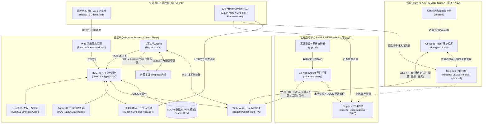

# RiriCloud

<div align="center">

**多节点 VPN / 代理管理系统**  
*Master-Agent 分布式架构 · SQLite WAL 本地存储 · WSS/HTTP 双模式通信 · 多协议内核托管 · 多格式订阅输出*

[](./CHANGELOG.md)
[](https://nodejs.org)
[](https://pnpm.io)
[](https://go.dev)
[](https://nestjs.com)
[](https://react.dev)
[](https://prisma.io)
[](./LICENSE)

[📖 系统概述](#-系统概述) • [📐 系统架构](#-系统架构) • [🚀 快速开始](#-快速开始) • [📦 生产部署](#-生产部署) • [🌐 开放接口与扩展](#-开放接口与扩展) • [🛠️ 技术栈](#️-技术栈) • [📂 目录结构](#-目录结构) • [📚 官方文档库](#-官方设计与技术文档) • [🗺️ 路线图](#️-路线图-roadmap)

</div>

---

## 📖 系统概述

**RiriCloud** 是一个采用控制平面与数据平面解耦（Master-Agent）的多节点代理纳管系统：

- **主控端 (Master Server & Web Dashboard)**：基于 NestJS 11 + React 19 + SQLite (WAL 模式) 构建。负责用户鉴权、节点纳管、中继线路编排、订阅模板编译、实时遥测收集与二进制升级分发；主控端内置本机 Agent 与 Sing-box 内核，支持单机独立开箱即用。
- **边缘节点端 (Edge Node Agent)**：基于 Go 编写的跨平台单静态二进制守护程序（`riri-agent`），托管 Sing-box 代理内核。支持通过 WebSocket (WSS) 长连接或 HTTP 定时轮询与主控端通信，负责内核进程生命周期管理、配置原子更新、网络探针诊断与用户流量统计采集。
- **客户端订阅引擎**：根据用户的套餐权限与模板策略，统一输出 Clash Meta (Mihomo)、Sing-box Client JSON 以及通用 Base64/URI 链接，并在响应头中返回 `Subscription-Userinfo` 流量与有效期元数据。

---

## 📐 系统架构



---

## 🚀 快速开始

### 1. 环境准备

- **Node.js**：`>= 20.0.0`
- **pnpm**：`>= 9.0.0`
- **Go**：`>= 1.22`（未安装系统 Go 时，可直接使用项目内置的便携工具链）

> **开发环境提示**：在 Git Bash 中执行 `source scripts/dev-env.sh` 即可自动配置项目内隔离的依赖缓存与本地便携 Go 工具链路径。

### 2. 本地初始化与演示数据播种

```bash
# 1. 克隆代码仓库
git clone https://github.com/your-org/riricloud.git
cd riricloud

# 2. 安装依赖并初始化数据库
pnpm setup
```

`pnpm setup` 用于本地开发演示，执行后会生成演示账号：

| 角色 | 邮箱 | 初始密码 |
| :--- | :--- | :--- |
| **系统管理员 (ADMIN)** | `admin@riricloud.local` | `riri-admin-demo` |
| **普通用户 (USER)** | `demo@riricloud.local` | `riri-user-demo` |

### 3. 启动开发模式

在两个终端中分别启动后端与前端：

```bash
# 终端 1：启动 NestJS 后端主控（监听 3000 端口）
pnpm dev:server

# 终端 2：启动 Vite 前端面板（监听 5173 端口，API 自动代理至 3000）
pnpm dev:web
```

访问入口：
- 🖥️ **Web 控制面板**：[http://localhost:5173](http://localhost:5173)
- 📑 **Swagger API 交互文档**：[http://localhost:3000/api/docs](http://localhost:3000/api/docs)

### 4. 本地联调边缘 Agent

```bash
# 编译当前平台 Agent
pnpm build:agent

# 编译发布支持的全部 Agent 平台
pnpm build:agent:all

# 指定目标平台并生成发布模式二进制
pnpm build:agent -- --target linux/amd64 --release

# 启动 Agent 连接本地主控（Token 从管理员「节点管理」复制）
AGENT_TOKEN="<AGENT_TOKEN>" MASTER_WS_URL="ws://localhost:3000/ws/agent" go run apps/agent/main.go run
```

---

## 📦 生产部署

### 1. 主控端 Docker Compose 部署（推荐）

主控镜像内置 Node.js 运行时、Prisma、Linux x64 本机 Agent 及 Sing-box 内核。

```bash
# 在 Linux / WSL shell 中执行；Windows 环境必须从 WSL 调用
cp .env.example .env
# 编辑 .env：配置 JWT_SECRET、ADMIN_EMAIL、ADMIN_PASSWORD、MASTER_LOCAL_HOST；可选设置 MASTER_DATA_PATH / AGENT_DATA_PATH 指定宿主机持久化目录；生产环境保持 AUTO_SEED=false（内嵌默认模板仍会自动创建）
pnpm docker:build
pnpm docker:up
```

Docker 构建、导出和 Compose 操作不接受 Windows PowerShell 或 Git Bash 作为执行 shell。Windows 开发机请先进入 WSL，再在仓库目录执行上述命令，例如：

```powershell
wsl.exe -d Ubuntu -- bash -lc "cd /path/to/riricloud && pnpm docker:build"
```

脚本会同时检查 Docker daemon 是否处于 Linux containers 模式；`pnpm docker:tags` 只读取版本和标签，不要求启动 Docker daemon。

- **首管理员引导**：空库首次启动时，主控会使用 `ADMIN_EMAIL` 与 `ADMIN_PASSWORD` 创建首个管理员账号；已有管理员时不会被环境变量覆盖。
- **内置本机节点**：主控启动时会自动注册 `Master-Local` 节点并启动内置 Agent 进程。
- **离线镜像部署**：`pnpm docker:build` 会将镜像打包导出至 `artifacts/docker/v<version>/<os>-<arch>/`。在无网络环境的目标服务器上，可直接通过 `docker load` 导入镜像并使用 `docker-compose.image.yml` 启动：

```bash
# 导入镜像
docker load -i artifacts/docker/v<version>/linux-amd64/riricloud-master_<version>_linux_amd64.tar.gz

# 启动服务
cp .env.image.example .env.image
docker compose --env-file .env.image -f docker-compose.image.yml up -d --no-build master
```

### 2. 主控端自包含发行包部署

在无需 Docker 的 Linux VPS 上，直接下载 GitHub Release 的 `riri-master_<version>_linux_amd64.tar.gz`：

```bash
tar -xzf riri-master_<version>_linux_amd64.tar.gz && cd riri-master_<version>_linux_amd64
cp .env.example .env   # 编辑 JWT_SECRET、ADMIN_EMAIL、ADMIN_PASSWORD、MASTER_LOCAL_HOST
./start.sh             # 自动完成迁移、管理员引导并启动主控与内置 Agent
```

### 3. 主控端源码构建部署

```bash
pnpm install
pnpm build
pnpm --filter @riricloud/server exec prisma migrate deploy
pnpm --filter @riricloud/server exec node prisma/bootstrap-admin.js
pnpm --filter @riricloud/server start:prod
```

### 4. 节点端 Agent 部署与运维

在主控面板点击「添加节点」获取安装命令，在目标 VPS（Linux / macOS / Windows）上以管理员身份执行：

```bash
# Linux amd64 原生安装示例
curl -fsSL --location -A 'riri-agent-installer/linux-amd64' \
  'https://<master-domain>/api/v1/downloads/agent?token=<AGENT_TOKEN>' \
  -o /tmp/riri-agent && install -m 0755 /tmp/riri-agent /usr/local/bin/riri-agent && \
  rm -f /tmp/riri-agent && \
  /usr/local/bin/riri-agent install --token=<AGENT_TOKEN> --master=wss://<master-domain>/ws/agent
```

#### Bubble Tea 全屏 TUI 控制台
直接在终端中无参数执行 `riri-agent`，即可进入基于 Bubble Tea 的全屏终端交互界面（TUI），支持方向键导航、配置表单填写、服务启停、诊断排错与日志查看。

#### 常用 CLI 运维命令
```bash
riri-agent status               # 查看服务与内核运行状态
riri-agent doctor               # 执行连通性、网络与环境诊断
riri-agent logs --follow        # 实时跟踪 Agent 运行日志
riri-agent restart              # 重启 Agent 守护进程
riri-agent uninstall --purge    # 卸载系统服务并彻底清理配置与内核文件
```

### 5. 管理员密码重置

当忘记管理员密码时，可通过命令行安全重置：

```bash
# 源码环境
pnpm admin:reset -- --email admin@example.com

# 发行包环境
./admin-reset.sh --email admin@example.com

# Docker 容器环境
docker compose exec -T master /nodejs/bin/node /app/prisma/admin-reset.js --email admin@example.com --password-stdin
```

### 6. Nginx 反向代理与订阅短链接

生产环境推荐使用 Nginx 作为 HTTPS、反向代理、WebSocket 和订阅伪静态处理层。Master 继续只维护标准订阅接口：

```text
https://domain.com/api/v1/sub/<UUID>
```

复制 `scripts/nginx/riricloud.conf.example` 到 Nginx 配置目录并按域名、证书和上游地址修改，检查通过后 reload：

```bash
sudo nginx -t
sudo systemctl reload nginx
```

示例会把严格 UUID 单段路径 `/<UUID>` 内部 rewrite 到 `/api/v1/sub/<UUID>`，保留 `?type=clash` 等查询参数，并为 `/ws/agent` 配置 WebSocket Upgrade。管理员在「系统设置 → 订阅与分发」开启短链接后，用户页面展示 `https://domain.com/<UUID>`；`subscriptionBaseUrl` 若为 `https://domain.com/panel`，则需同步使用示例中的 `/panel/<UUID>` rewrite 配置。短链接开关默认关闭，且不会自动检测 Nginx 是否完成配置。

---

## 🌐 开放接口与扩展

### 1. 通用多格式订阅输出
主控订阅端点：`GET /api/v1/sub/:token`
- **自动格式匹配**：根据 `?type=clash|singbox|base64` 参数或客户端 `User-Agent` 自动返回对应格式配置。
- **流量与有效期响应头**：标准返回 `Subscription-Userinfo: upload=...; download=...; total=...; expire=...` 与 `Profile-Update-Interval`。
- **Nginx 伪静态入口**：部署边缘配置后，`GET /<UUID>` 或 `GET /<prefix>/<UUID>` 由 Nginx rewrite 到上述标准接口，后端业务和响应语义保持不变。

### 2. OpenAPI / Swagger 接口契约
主控端内置交互式 API 文档，启动后访问 `/api/docs` 即可查看并调试全部 RESTful 接口（认证、用户与订阅管理、节点与线路编排、套餐与模板管理、遥测与系统设置）。

### 3. Agent 通信网关与任务调度
- **双传输模式**：Agent 支持 WebSocket (WSS) 全双工长连接与 HTTP (`POST /api/v1/agent/poll`) 定时轮询两种模式。
- **主动任务分发**：支持向在线节点下发网络探针任务（TCP/DNS/ICMP 延迟与丢包率测试）以及内核/Agent 自更新升级任务。

### 4. 高级配置覆盖与内核导入
- **高级模式覆盖 (`configOverride`)**：支持在节点层级注入自定义 Sing-box 顶层 JSON 字段，与主控合成的线路入站/出站规则进行深层合并。
- **多架构内核资产导入**：管理员可通过 `POST /api/v1/admin/binaries/import` 导入自定义架构的 Sing-box 二进制包，由主控完成 SHA-256 校验并供 Agent 升级分发。

---

## 🛠️ 技术栈

| 模块 | 技术选型 | 关键说明 |
| :--- | :--- | :--- |
| **主控后端 (Server)** | NestJS 11 + TypeScript | Controller-Service-Repository 分层架构，Swagger 接口契约 |
| **持久化与 ORM** | SQLite + Prisma ORM 6.x | 单文件轻量存储，WAL 模式保障并发读写 |
| **实时通信网关** | `@nestjs/websockets` + `ws` | WebSocket over TLS (WSS) 双向长连接与 HTTP 轮询支持 |
| **前端面板 (Web)** | React 19 + Vite 6 + TypeScript | 模块化单页应用，Tailwind CSS + shadcn/ui 组件系统 |
| **前端状态与表格** | Zustand + TanStack Query / Table | 全局状态管理、接口数据缓存与复杂数据表格 |
| **边缘节点 (Agent)** | Go 1.25+ + Cobra + Bubble Tea + kardianos/service | 单静态二进制，`CGO_ENABLED=0`，跨平台系统服务与全屏 TUI |
| **代理协议内核** | Sing-box | 支持 VLESS-Reality、Hysteria2、TUIC、Shadowsocks、ShadowTLS |
| **工程架构治理** | pnpm Monorepo + Husky + Commitlint | Conventional Commits 规范，ESLint 9，Jest，五合一质量门禁 |

---

## 📂 目录结构

```text
riricloud/
├── apps/
│   ├── web/               # React 19 前端面板（Vite 6 + shadcn/ui）
│   ├── server/            # NestJS 11 主控后端（Prisma ORM + WSS Gateway）
│   └── agent/             # Go 边缘节点守护程序（Cobra CLI + Bubble Tea TUI）
├── docs/                  # 官方设计与技术规范文档库
│   └── plans/             # 实施计划总台账与归档目录
├── scripts/               # 环境、门禁、构建与发布脚本
├── artifacts/             # 【gitignore】统一的本地 Agent、Release 与 Docker 产物目录
│   ├── dev/agent/         # 本地构建的 Agent 二进制
│   ├── releases/          # scripts/release.sh 生成的发行包与校验和
│   └── docker/            # scripts/docker-build.sh 导出的 Docker 离线镜像
├── .cache/                # 【gitignore】本地便携依赖缓存
├── .tools/                # 【gitignore】便携开发工具链（如本地 Go）
├── AGENTS.md              # AI 代理与协作者工作规范
├── CHANGELOG.md           # 遵循 Keep a Changelog 的版本变更日志
└── package.json           # Monorepo 统一版本管理与全局 scripts
```

---

## 🛡️ 质量门禁与工程规范

代码合入前必须通过五合一质量门禁：

```bash
# 运行全部门禁检查
pnpm gate

# 单独检查各端
pnpm gate:version  # 校验版本号合规性与 PR 递增约束
pnpm gate:docs     # 校验文档治理与规划归档机械约束
pnpm gate:server   # 后端：TypeScript 类型检查 + ESLint + Jest 单元测试
pnpm gate:web      # 前端：TypeScript 类型检查 + ESLint + Vite 生产构建
pnpm gate:agent    # 节点：go vet + gofmt + go test + 跨平台构建
```

---

## 📚 官方设计与技术文档

详细设计与开发规范请查阅 [docs/ 目录](./docs/README.md)：

| 文档 | 描述 |
| :--- | :--- |
| [系统架构设计 (ARCHITECTURE.md)](./docs/ARCHITECTURE.md) | 总体拓扑、Master-Agent 分布式架构、安全模型与全双工时序 |
| [技术选型全景 (TECH_STACK.md)](./docs/TECH_STACK.md) | 前后端、数据库、节点守护程序与代理内核选型细节 |
| [数据模型设计 (DATA_MODELS.md)](./docs/DATA_MODELS.md) | SQLite + Prisma ORM 实体关系、数据字典与索引设计 |
| [接口与通信协议 (API_AND_PROTOCOLS.md)](./docs/API_AND_PROTOCOLS.md) | RESTful API 规范、WebSocket 通信协议与订阅引擎标准 |
| [前端 UI 设计规范 (FRONTEND_UI_GUIDELINES.md)](./docs/FRONTEND_UI_GUIDELINES.md) | shadcn/ui 组件分层、暗黑模式预设与表格/表单规范 |
| [部署与运维指南 (DEPLOYMENT_GUIDE.md)](./docs/DEPLOYMENT_GUIDE.md) | 主控端生产部署、Agent 原生 CLI 安装与运维排错 |
| [实施路线图 (ROADMAP.md)](./docs/ROADMAP.md) | 迭代里程碑、模块开发步骤与各阶段验收标准 |
| [版本管理规范 (VERSIONING.md)](./docs/VERSIONING.md) | SemVer 最小递增原则、统一版本号与发版流程 |
| [Git 工作流规范 (GIT_WORKFLOW.md)](./docs/GIT_WORKFLOW.md) | GitHub Flow 分支模型与 Conventional Commits 规范 |
| [代码审查与约束 (CODE_REVIEW.md)](./docs/CODE_REVIEW.md) | 质量门禁清单、三端分层硬约束与审查清单 |
| [项目全局硬约束 (PROJECT_CONSTRAINTS.md)](./docs/PROJECT_CONSTRAINTS.md) | 技术栈锁定、零外部依赖红线与安全规范 |
| [AI 代理工作规范 (AGENTS.md)](./AGENTS.md) | 面向 AI 代理与协作者的硬性规则摘要与文档映射 |

---

## 🗺️ 路线图 (Roadmap)

- [x] **Phase 1: 基础设施与 Monorepo 体系** (pnpm Workspace / ESLint / Husky / 缓存隔离 / 统一产物目录)
- [x] **Phase 2: 主控端核心能力** (JWT 鉴权 / 用户管理 / 节点与中继线路解耦 / WSS+HTTP 网关 / SQLite WAL 事务 / 系统设置)
- [x] **Phase 3: 订阅架构与生命周期** (套餐市场 / 订阅生命周期 / 订阅模板引擎 / Clash Meta、Sing-box、Base64 多格式输出)
- [x] **Phase 4: Go 边缘 Agent 基线与生命周期** (WSS/HTTP 双通信 / 指数退避重连 / Sing-box 内核进程守护 / 动态配置原子落盘 / 用户流量统计采集)
- [x] **Phase 5: Agent 现代化 CLI 与 TUI** (Cobra 命令行 / Bubble Tea 全屏控制台 TUI / 跨平台系统服务适配 / Doctor 环境诊断 / 日志跟踪)
- [x] **Phase 6: 部署套件与升级分发** (Master Docker Compose 编排 / 离线镜像双标签导出 / 探针快照与自包含升级分发 / 管理员引导与安全重置)
- [ ] **Phase 7: 进阶演进 (v0.5.0+)** (真实客户端自动化连通性验证套件 / 远程规则集动态订阅与自更新生态 / 高级账单与支付网关对接)

---

## 📄 开源协议

本项目源码遵循 [GNU General Public License v3.0 (GPL-3.0)](./LICENSE) 协议开源。
