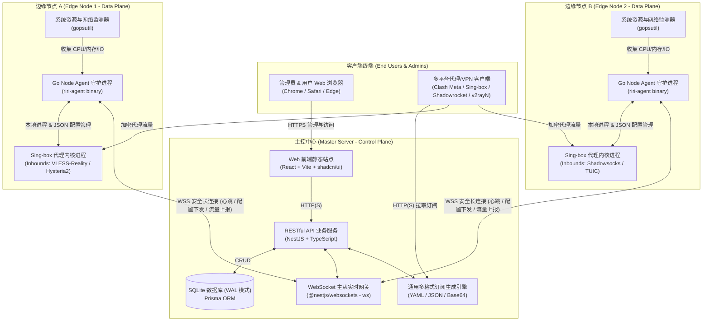
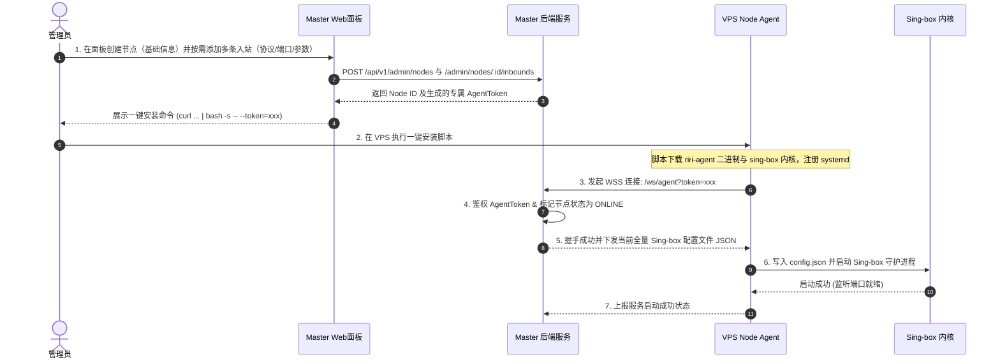
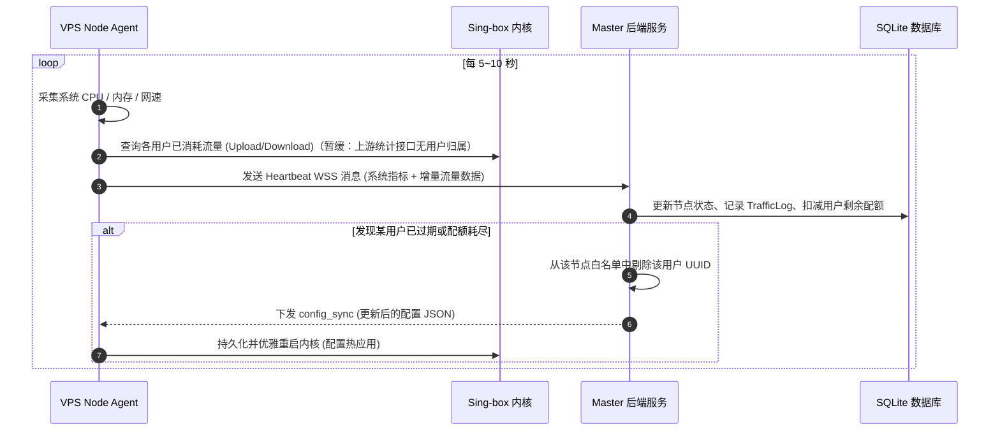

# 系统架构设计 (Architecture Design)

## 1. 总体架构拓扑

RiriCloud 采用清晰的 **Master-Agent（控制平面 - 数据平面）** 分布式解耦架构设计：

---

## 2. 核心组件分工

### 2.1 主控中心 (Master Server)
- **Web UI (`apps/web`)**：为用户和管理员提供现代化的 Web 控制界面。包括用户注册登录、流量仪表盘、节点列表、通用订阅导出，以及管理员的用户管理、节点纳管、配置下发和系统状态监控。
- **业务 API 服务 (`apps/server`)**：基于 NestJS 框架开发，提供标准的 RESTful 接口与 JWT 鉴权。
- **WebSocket 实时网关 (`apps/server/agent-gateway`)**：与分布在全球的各 Node Agent 保持双向全双工长连接，实现秒级状态同步与实时配置热推。
- **订阅引擎 (`apps/server/subscription`)**：根据用户的有效权限与节点公开入站（`NodeInbound.isPublic`），实时动态组装多协议（VLESS Reality / Hysteria2 / Shadowsocks / TUIC）三格式订阅：Clash Meta (Mihomo) YAML、Sing-box Client JSON 以及通用 Base64 URI 列表。输出名规则：单入站节点用节点名，多入站节点为「节点名·tag」，重名全局去重。
- **入站配置组装 (`apps/server/common/inbound.ts`)**：入站参数归一化（默认值填充/密钥自动生成/必填校验）与 sing-box 服务端入站 JSON 组装的单一实现，`config_sync` 与订阅 builders 复用，避免两处各持一份协议知识。
- **持久化层 (Prisma + SQLite)**：单文件轻量化存储，开启 WAL（Write-Ahead Logging）模式支持高并发读取，免去维护额外数据库容器的运维负担。

### 2.2 边缘节点守护程序 (Node Agent - `apps/agent`)
- **长连接与自愈**：Agent 启动后主动与 Master 建立 WSS 连接，内置重试与断线重连机制。
- **内核生命周期管理**：Agent 内置 supervisor 单协程托管 Sing-box 子进程——`config_sync` 原子落盘后拉起内核（二进制路径 `SINGBOX_BINARY_PATH`，默认走 PATH），配置字节比对变化时优雅重启（SIGTERM → 宽限 → Kill）即热应用，进程异常退出按指数退避自动拉起。内核二进制由部署方式提供（自动下载校验留待 Phase 5 一键脚本）。
- **配置预检与回滚（v0.3.0）**：落盘后、拉起前执行 `sing-box check -c` 预检（15s 超时）；失败则拒绝该配置、把磁盘回滚为 lastGood、在跑内核不受影响，并通过 `config_apply_result` 回执失败原因。内核 stderr 环形采样尾部 8KB，异常退出原因随心跳 `lastError` 上报。
- **多入站监听**：节点可挂多条不同协议入站（`NodeInbound`，结构见 `docs/DATA_MODELS.md` §2.1）；hy2/tuic 服务端 TLS 证书为 Agent 机本地路径，主控不托管证书文件。
- **系统遥测 (Telemetry)**：基于 `gopsutil` 定期采集服务器 CPU 占用、内存使用、磁盘及实时网络带宽吞吐，随心跳上报（含内核状态 `kernelRunning`/`appliedConfigVersion`/`lastError`，落 `Node.kernelRunning`/`Node.configError`）。
- **流量统计与上报**：协议已约定按用户 UUID 的增量流量字段；因 sing-box 官方统计接口（Clash API `/connections`）暂不提供连接到入站用户的归属字段，按用户采集暂缓，待上游能力就绪后启用。SS 入站为共享密码模式，按用户流量归属在该协议下不可用（按用户配额粒度本就暂缓，可接受）。

---

## 3. 核心业务与数据交互时序

### 3.1 节点接入与全自动初始化流程

### 3.2 节点遥测心跳与流量核算

---

## 4. 安全设计 (Security Architecture)

1. **管理与用户访问安全**：
   - 密码使用 `bcrypt` 单向哈希加盐存储。
   - API 采用 JWT 无状态鉴权，具备过期时间与刷新机制。
   - 角色访问控制（RBAC）：细分 `ADMIN` 和 `USER` 权限路由守卫。
2. **Master-Agent 通信安全**：
   - 生产环境强制采用 WSS (WebSocket over TLS) 加密传输。
   - 每个节点在主控端创建时分配唯一的 `AgentToken`（64位高熵随机串），Agent 握手时强制鉴权。
3. **代理传输安全 (Reality / TLS)**：
   - 首推 **VLESS + Reality** 协议：无需自备域名与公网证书，通过窃用大型合法网站（如 `www.apple.com`, `gateway.icloud.com` 等）的 SNI 与 TLS 握手特征，实现极强的抗封锁能力。
   - 支持 **Hysteria2 / TUIC** 协议：基于 UDP/QUIC，具备拥塞控制与抗高丢包能力。
