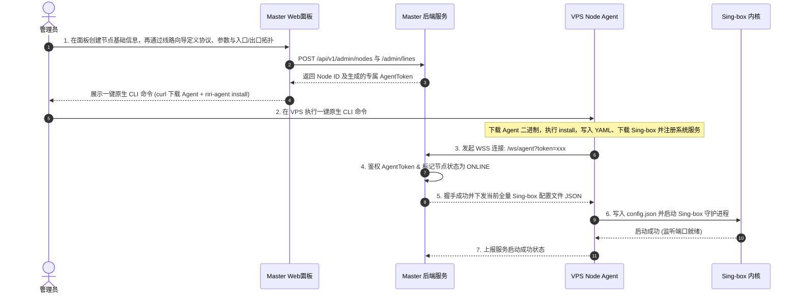
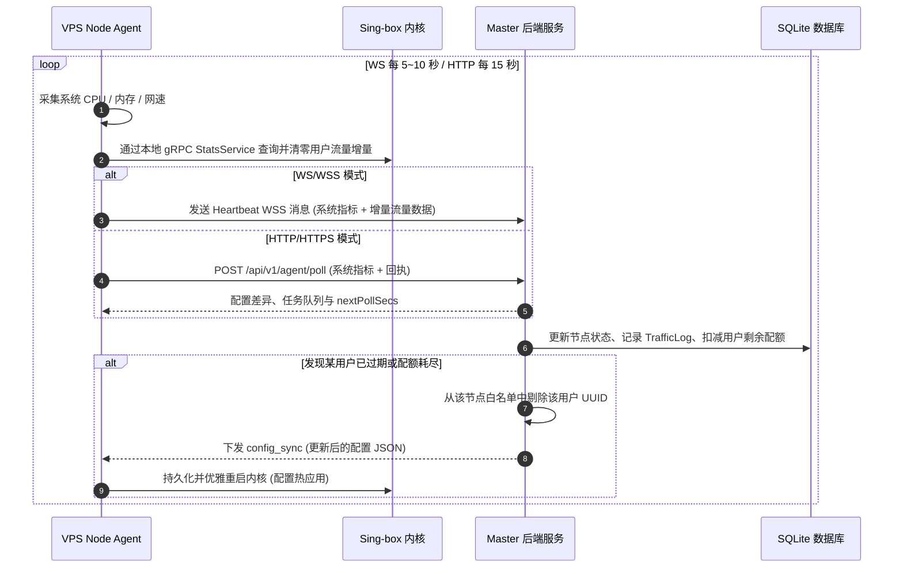
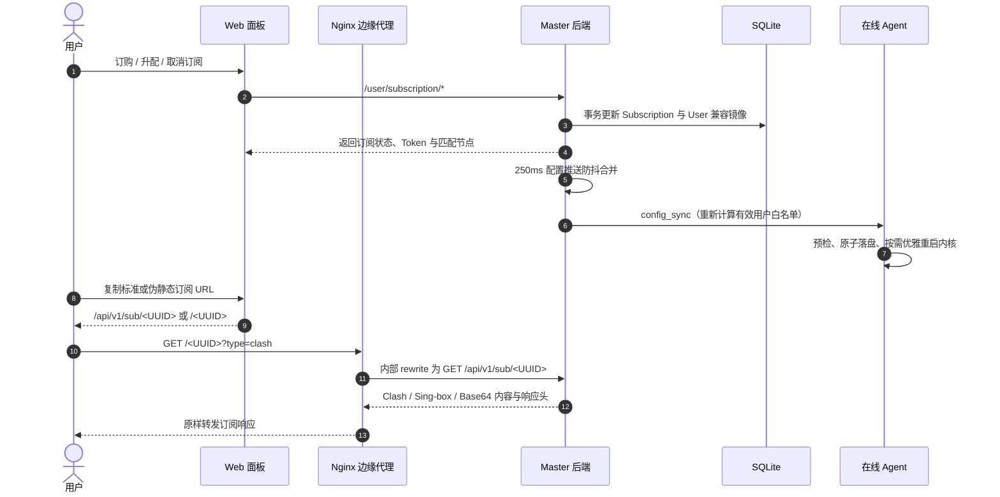
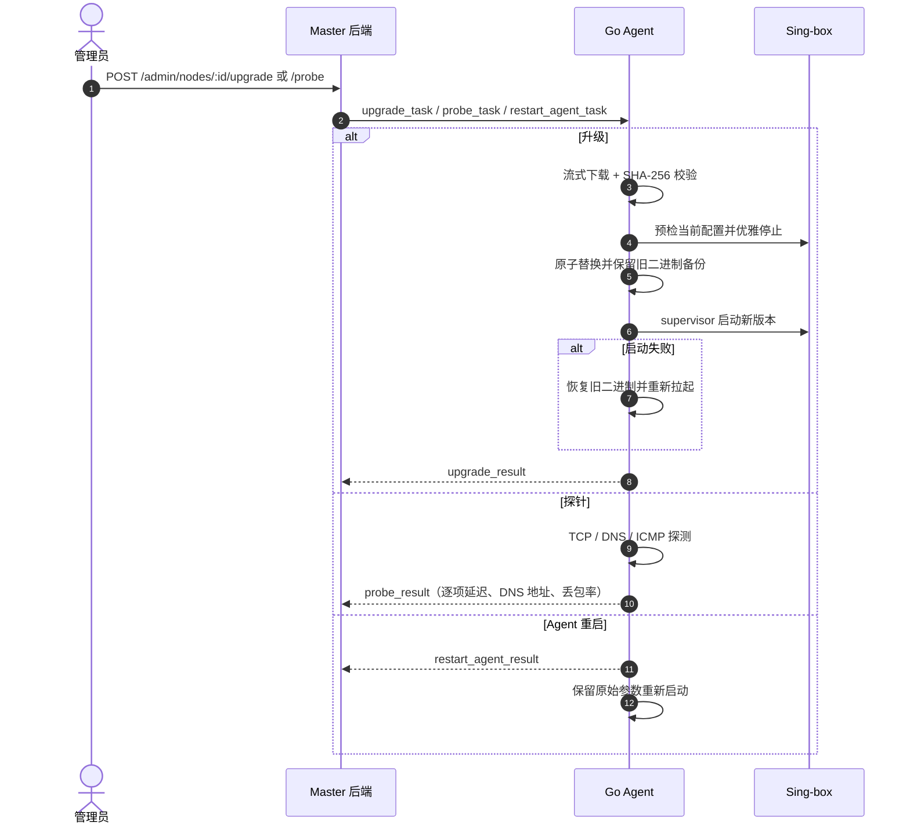

# 系统架构设计 (Architecture Design)

## 1. 总体架构拓扑

RiriCloud 采用清晰的 **Master-Agent（控制平面 - 数据平面）** 分布式解耦架构设计：

```mermaid
graph TB
    subgraph "客户端终端 (End Users & Admins)"
        UserBrowser["管理员 & 用户 Web 浏览器<br/>(Chrome / Safari / Edge)"]
        VpnClients["多平台代理/VPN 客户端<br/>(Clash Meta / Sing-box / Shadowrocket / v2rayN)"]
    end

    EdgeProxy["Nginx 边缘代理<br/>(HTTPS / rewrite / WSS / 限流)"]

    subgraph "主控中心 (Master Server - Control Plane)"
        direction TB
        FrontendUI["Web 前端静态站点<br/>(React + Vite + shadcn/ui)"]
        APIServer["RESTful API 业务服务<br/>(NestJS + TypeScript)"]
        WSGateway["WebSocket 主从实时网关<br/>(@nestjs/websockets - ws)"]
        AgentPollAPI["Agent HTTP 轮询适配器<br/>(POST /api/v1/agent/poll)"]
        SubscriptionEngine["通用多格式订阅生成引擎<br/>(YAML / JSON / Base64)"]
        SQLiteDB[("SQLite 数据库 (WAL 模式)<br/>Prisma ORM")]
        LocalAgent["内置本机 Agent<br/>(riri-agent)"]
        LocalSingbox["内置本机 Sing-box"]
        
        FrontendUI -->|"HTTP(S)"| APIServer
        APIServer <-->|"CRUD"| SQLiteDB
        APIServer <--> WSGateway
        APIServer <--> AgentPollAPI
        APIServer <--> SubscriptionEngine
        LocalAgent <-->|"WS / 本机进程"| WSGateway
        LocalAgent <-->|"本地 JSON 配置管理"| LocalSingbox
        LocalAgent -->|"本地 gRPC StatsService"| LocalSingbox
        LocalAgent -->|"CPU/内存/网络与用户流量遥测"| APIServer
    end

    subgraph "边缘节点 A (Edge Node 1 - Data Plane)"
        direction TB
        AgentA["Go Node Agent 守护进程<br/>(riri-agent binary)"]
        SingboxA["Sing-box 代理内核进程<br/>(Inbounds: VLESS-Reality / Hysteria2)"]
        SystemMonitorA["系统资源与网络监测器<br/>(gopsutil)"]

        AgentA <-->|"本地进程 & JSON 配置管理"| SingboxA
        SystemMonitorA -->|"收集 CPU/内存/IO"| AgentA
    end

    subgraph "边缘节点 B (Edge Node 2 - Data Plane)"
        direction TB
        AgentB["Go Node Agent 守护进程<br/>(riri-agent binary)"]
        SingboxB["Sing-box 代理内核进程<br/>(Inbounds: Shadowsocks / TUIC)"]
        SystemMonitorB["系统资源与网络监测器<br/>(gopsutil)"]

        AgentB <-->|"本地进程 & JSON 配置管理"| SingboxB
        SystemMonitorB -->|"收集 CPU/内存/IO"| AgentB
    end

    UserBrowser -->|"HTTPS 管理与访问"| EdgeProxy
    VpnClients -->|"HTTPS 标准或伪静态订阅"| EdgeProxy
    EdgeProxy -->|"反向代理 HTTP / WSS"| APIServer
    EdgeProxy -.->|"/<UUID> 内部 rewrite 到 /api/v1/sub/<UUID>"| SubscriptionEngine
    UserBrowser -.->|"Master 托管 Web 静态资源"| FrontendUI
    VpnClients -.->|"标准订阅业务处理"| SubscriptionEngine
    VpnClients -->|"加密代理流量"| SingboxA
    VpnClients -->|"加密代理流量"| SingboxB

    AgentA <-->|"WSS 安全长连接 (心跳 / 配置下发 / 流量上报 / 升级 / 探针)"| WSGateway
    AgentB <-->|"WSS 安全长连接 (心跳 / 配置下发 / 流量上报 / 升级 / 探针)"| WSGateway
    AgentA -->|"HTTP/HTTPS 定时轮询 (遥测 / 配置 / 任务)"| AgentPollAPI
    AgentB -->|"HTTP/HTTPS 定时轮询 (遥测 / 配置 / 任务)"| AgentPollAPI
```

---

## 2. 核心组件分工

### 2.1 主控中心 (Master Server)
- **Web UI (`apps/web`)**：为用户和管理员提供现代化的 Web 控制界面。包括用户注册登录、流量仪表盘、线路列表、通用订阅导出，以及管理员的用户管理、节点纳管、线路拓扑配置、配置下发和系统状态监控。
- **业务 API 服务 (`apps/server`)**：基于 NestJS 框架开发，提供标准的 RESTful 接口与 JWT 鉴权。
- **Agent 统一业务服务 (`apps/server/agent-gateway/agent.service.ts`)**：维护节点鉴权、遥测事务、配置快照、任务队列、探针快照与健康判定；WS 网关和 HTTP 轮询控制器均为薄传输适配器。
- **主控二进制分发中心 (`apps/server/src/binaries`)**：维护规范的双层存储架构：最高优先级的运行态持久仓 `data/binaries/`（支持多架构自定义导入、热更新与远程缓存）与静态内置仓 `binaries/`（发行包仅精准预置当前宿主架构的二进制）；开发环境下智能回退至 `artifacts/binaries`。升级任务按节点 `osArch` 选择主控内置或导入版本，下载端点使用 AgentToken 鉴权。
- **WebSocket 实时网关 (`apps/server/agent-gateway`)**：与分布在全球的各 Node Agent 保持双向全双工长连接，实现秒级状态同步与实时配置热推。
- **HTTP 轮询适配器 (`POST /api/v1/agent/poll`)**：为无法完成 WS Upgrade 的网络提供 HTTPS 主动上报、配置差异拉取和异步任务回执。
- **内置本机 Agent (`apps/agent` + `riri-agent`)**：Docker 镜像和 Linux x64 自包含发行包内置 Agent 与 Sing-box；启动时先完成数据库迁移和 `Master-Local` bootstrap，再启动 Master，等待健康接口就绪后让 Agent 通过回环 WS 连接本机网关。远程 VPS 使用 Agent 原生 CLI 安装并接入，CLI 自己管理配置、服务和诊断。
- **线路与订阅引擎 (`apps/server/lines`、`apps/server/subscription`)**：Line 是用户订阅端点的唯一业务实体，直接拥有协议、参数、监听地址、Tag、入口/出口拓扑和端口，支持直连、盲转发和协议代理中继；订阅服务按套餐匹配公开启用且入口/出口节点在线的线路，动态组装 Clash Meta YAML、Sing-box Client JSON 和 Base64 URI，并应用地址/端口、SNI/Host 与倍率覆盖。
- **入站配置组装 (`apps/server/common/inbound.ts`)**：入站参数归一化（默认值填充/密钥自动生成/必填校验）、服务端入站 JSON 与客户端 TLS/Transport JSON 组装的单一实现，`config_sync` 与订阅 builders 复用，避免两处各持一份协议知识；其中 WebSocket `host` 统一映射为 `headers.Host`，SS2022 用户密钥按算法长度归一化。ShadowTLS 固定为 v3 + SS2022 内层，配置生成两个入站：公网 ShadowTLS 外层通过 `detour` 接入仅监听回环地址的 SS 入站，用户凭证只用于外层用户鉴权。
- **套餐与订阅控制面 (`apps/server/plans`、`apps/server/subscription`、`apps/server/subscription-templates`)**：Plan 决定线路标签/显式 ID 授权范围，Subscription 维护用户唯一订阅和生命周期，Template 驱动 Clash/Sing-box 的策略组、规则、DNS 与顶层覆写；订阅和 User 兼容镜像在事务中同步。
- **持久化层 (Prisma + SQLite)**：单文件轻量化存储，开启 WAL（Write-Ahead Logging）模式支持高并发读取，免去维护额外数据库容器的运维负担。

### 2.2 边缘节点守护程序 (Node Agent - `apps/agent`)
- **双模式通信与自愈**：Agent 根据 `MASTER_URL` 的 `ws(s)://` / `http(s)://` 前缀推导模式，也可由 `AGENT_MODE=ws|http` 显式指定；WS 模式具备指数退避重连，HTTP 模式按 `POLL_INTERVAL_SECS` 轮询并接受 Master 的 `nextPollSecs` 调整；服务端只接受通过结构校验的 Agent 上行数据。
- **内核生命周期管理**：Agent 内置 supervisor 单协程托管 Sing-box 子进程——`config_sync` 原子落盘后拉起内核（二进制路径由 YAML 配置或 `SINGBOX_BINARY_PATH` 指定），配置字节比对变化时优雅重启（SIGTERM → 宽限 → Kill）即热应用，进程异常退出按指数退避自动拉起。Docker Master 镜像和自包含发行包直接携带 Linux Sing-box；远程 Agent 由 `install` 命令从 Master 获取内核，失败时可回退 GitHub Release。
- **Agent 生命周期 CLI**：`riri-agent` 由 Cobra 分发一级命令；无参数且连接终端时进入 Bubble Tea + lipgloss 全屏控制台 GUI/TUI，使用 raw mode 直接消费方向键，提供菜单、安装表单、卸载确认、异步任务和结果滚动页；无 TTY 或显式子命令仍走非交互 CLI。服务注册与启停通过 `kardianos/service` 适配 systemd/OpenRC/SysVinit、Windows Service 和 macOS Launchd。标准配置为 `/etc/riri-agent/config.yaml`，运行时目录为 `/var/lib/riri-agent/`。
- **配置预检与回滚（v0.3.0）**：落盘后、拉起前执行 `sing-box check -c` 预检（15s 超时）；失败则拒绝该配置、把磁盘回滚为 lastGood、在跑内核不受影响，并通过 `config_apply_result` 回执失败原因。内核 stderr 环形采样尾部 8KB，**非预期退出**（崩溃）原因随心跳 `lastError` 上报；配置变更引发的主动重启（SIGTERM/Kill 退出码非 0）属预期停止，不记错误、不计退避；内核拉起成功即清除历史失败原因。
- **远程升级与网络诊断（v0.3.0）**：升级任务默认使用 Master 内置二进制分发中心，也可显式指定已校验的自定义 URL；Agent 流式下载至临时文件并校验。Sing-box 在升级窗口抑制 supervisor，保留旧二进制备份，确认新进程启动后再清理备份，失败则恢复旧版本。Agent 自身升级或管理员快捷重启均保留启动参数；探针支持 TCP、DNS、ICMP，返回延迟、丢包率、DNS 地址和错误，并由 Master 保存最近一次快照。
- **Line 驱动的监听与中继**：节点不再由管理员维护业务入站；主控按节点承担的启用 Line 自动生成协议入站、盲转发 `direct` 入站、协议代理 outbound 和 route。监听地址由 Line 可视化编辑，默认 `0.0.0.0`；Tag 可自定义，空值时按 Line ID 派生，中继入口/出口自动追加角色后缀。Line 端口未指定时由主控随机分配 `20000~29999` 的五位端口；同节点同 TCP/UDP 传输层端口互斥，已有端口在编辑、重启和配置同步时保持不变。历史 `NodeInbound` 仅保留作迁移兼容，不参与新配置生成。标准 TLS 可通过 `Certificate` 实体统一托管，Master 在 `config_sync` 时以内嵌 PEM 数组下发并在证书更新后级联同步关联节点；未关联证书的线路仍支持 Agent 机本地路径。
- **系统遥测 (Telemetry)**：基于 `gopsutil` 定期采集服务器 CPU 占用、内存使用、磁盘及实时网络带宽吞吐，随心跳上报。网络吞吐拆分为 `uploadRate` / `downloadRate`（bytes/s），并保留兼容字段 `bandwidthRate`；计数器回绕或采样异常时对应方向归零。节点当前速率落在 `Node`，历史速率进入 `NodeRateMetric` 的 UTC 五分钟桶，保留 30 天。
- **流量统计与上报**：服务端为每个节点配置本地 `experimental.v2ray_api` gRPC StatsService，Agent 使用 `QueryStats(reset=true)` 读取 `user>>>{name}>>>traffic>>>uplink/downlink` 并作为心跳增量上报。Master 在同一 SQLite 事务内写入 `TrafficLog`、扣减 `Subscription.trafficUsedBytes` 并同步 `User.trafficUsedBytes` 镜像；共享密码模式的 SS 没有用户归属，按协议粒度不产生用户流量记录。
- **网络速率统计查询**：`GET /admin/traffic/overview` 同时返回节点网络吞吐当前摘要与历史 `rateSeries`。当前值仅汇总在线且未超时节点；历史按查询周期重采样为 5 分钟、30 分钟或 1 小时。该指标描述网卡吞吐，不进入 `TrafficLog`，中继入口与出口的重复网络传输允许分别计入。

---

## 3. 核心业务与数据交互时序

### 3.1 节点接入与全自动初始化流程

### 3.2 线路、中继与配置联动

线路管理由 Line 一次性定义协议参数、入口节点/端口和出口节点/端口：直连线路要求入口与出口相同；RELAY 线路由入口节点监听 `entryPort`，再把流量转发到出口节点的 `exitPort`，缺省端口由服务端随机分配五位端口。保存线路后复用 250ms 防抖，将承担入口或出口角色的在线节点重新生成并推送 `config_sync`。盲转发在入口侧保持端到端加密，协议代理在入口侧终止并重新建立目标协议连接。

### 3.3 节点遥测心跳与流量核算

### 3.4 订阅生命周期与配置联动

订阅输出请求通过 Token 定位 Subscription，再按 Plan 过滤公开、启用且底层在线的 Line；模板为空时读取全局默认模板。Token 重置同时更新 Subscription 与 User，旧 URL 立即失效。Nginx 只承担入口 rewrite 和代理，不参与 Token、权限或订阅格式业务判断。

### 3.5 远程升级与网络探针时序

---

## 4. 安全设计 (Security Architecture)

1. **管理与用户访问安全**：
   - 密码使用 `bcrypt` 单向哈希加盐存储。
   - API 采用 JWT 无状态鉴权，具备过期时间与刷新机制。
   - 角色访问控制（RBAC）：细分 `ADMIN` 和 `USER` 权限路由守卫。
2. **Master-Agent 通信安全**：
   - 生产环境强制采用 WSS (WebSocket over TLS) 加密传输。
   - 每个节点在主控端创建时分配唯一的 `AgentToken`（64位高熵随机串），Agent 握手时强制鉴权。
   - Agent 上行消息先经过类型、范围、数组长度和文本长度校验；升级任务同时校验 URL 协议与 64 位十六进制 SHA-256，失败输入不进入业务层。
3. **代理传输安全 (Reality / TLS)**：
   - 首推 **VLESS + Reality** 协议：无需自备域名与公网证书，通过窃用大型合法网站（如 `www.apple.com`, `gateway.icloud.com` 等）的 SNI 与 TLS 握手特征，实现极强的抗封锁能力。
   - 支持 **Hysteria2 / TUIC** 协议：基于 UDP/QUIC，具备拥塞控制与抗高丢包能力。
4. **边缘入口安全**：
   - 生产环境由 Nginx 终止 HTTPS/WSS，并将管理面板、标准订阅、UUID 伪静态订阅和 `/ws/agent` 统一代理到 Master；Master 不内置通用反向代理。
   - 短链 location 只匹配严格 UUID 单段 GET 路径，避免吞掉 `/login`、`/admin`、`/api/**` 和 SPA 路由；部署者必须保持 `subscriptionBaseUrl` pathname 与 Nginx rewrite 前缀一致。
