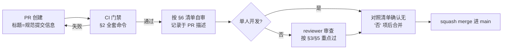

# 代码审查与架构约束 (Code Review & Architecture Constraints)

本文档包含两部分：**架构硬约束**（各技术栈内必须遵守的分层与组织规则，违反即打回）与**代码审查流程**（质量门禁、审查清单）。全局性的红线（依赖、安全、资源上限）见 [PROJECT_CONSTRAINTS.md](./PROJECT_CONSTRAINTS.md)。

---

## 1. 总体分层原则

RiriCloud 分三个应用：`apps/server`（NestJS）、`apps/web`（React）、`apps/agent`（Go）。所有应用共同遵守：

1. **依赖只能向下**：路由/入口层 → 业务逻辑层 → 数据/基础设施层；禁止反向依赖或同层循环引用。
2. **协议即契约**：REST API、WS 消息、订阅输出格式以 [API_AND_PROTOCOLS.md](./API_AND_PROTOCOLS.md) 为准文档，实现与文档不一致视为 bug（先改文档再改代码）。
3. **一处一个真相**：同一业务规则（如配额判定、节点可见性）只允许在一个 Service/模块中实现，其余调用方复用。

---

## 2. 质量门禁 (Quality Gates)

任何 PR 合入 `main` 前必须全绿（工具链在 Phase 1 落地，见 [ROADMAP.md](./ROADMAP.md)）：

| 应用 / 领域 | 门禁命令 |
| :--- | :--- |
| **版本与日志治理** | `pnpm gate:version`（SemVer 合规、单仓唯一版本源、PR 核心代码递增校验、package.json/CHANGELOG/README 徽标三向一致性校验） |
| **文档与规划治理** | `pnpm gate:docs`（根目录白名单、规划 Frontmatter、100% 完成归档阻断、代码-文档联动规则阻断） |
| `apps/server` | `pnpm gate:server`（`tsc --noEmit` · ESLint · 单元测试） |
| `apps/web` | `pnpm gate:web`（`tsc --noEmit` · ESLint · `vite build`） |
| `apps/agent` | `pnpm gate:agent`（`go vet ./...` · `gofmt -l .` · `go test ./...` · `go build`） |
| 跨端协议变更 | 必须附 WS 消息或 REST 契约的前后对照说明 |

CI 未全绿禁止合并；本地提交前应先跑过同套命令。单人开发时**代码审查以自审 + 门禁代替**：合入前对照本文 §6 清单逐项自查，并在 PR 描述中留自查记录。

---

## 3. 架构硬约束（按应用）

### 3.1 主控后端 `apps/server`（NestJS + Prisma）

```
Controller（HTTP/WS 入口）
    │  只做：参数校验、鉴权声明、调 Service、组装响应
    ▼
Service（业务逻辑，可复用单元）
    │  只做：业务规则、事务、跨模块编排
    ▼
PrismaService（数据访问，全局唯一 PrismaClient 实例）
```

| # | 约束 | 说明 |
| :-: | :--- | :--- |
| S1 | **禁止 Controller 直接注入 PrismaService** | 一切数据访问经过 Service；Controller 出现 `prisma.` 调用直接打回 |
| S2 | **入参强制 DTO + class-validator** | 所有 body/query/param 经 `ValidationPipe` 校验，禁止裸收 `any` |
| S3 | **WS Gateway 与 REST Controller 共用同一 Service 层** | Gateway 里写业务逻辑 = 复制第二条真相，打回；Gateway 只做连接管理与消息编解码 |
| S4 | **一个领域一个 Nest Module** | `auth` / `users` / `nodes` / `subscription` / `agent-gateway` / `system`，跨模块只能 import 对方 Module 导出的 Service |
| S5 | **Prisma schema 变更必须走 migration** | 禁止 `db push` 进 main；schema 改动与 [DATA_MODELS.md](./DATA_MODELS.md) 同一 PR 内同步更新 |
| S6 | **流量扣减必须事务** | `trafficUsedBytes` 更新与 `TrafficLog` 写入在同一事务内，防两处不一致 |

### 3.2 前端 `apps/web`（React + TanStack Query + Zustand）

| # | 约束 | 说明 |
| :-: | :--- | :--- |
| W1 | **请求只经统一 API 客户端** | 组件内出现裸 `fetch`/自建 `axios` 实例 = 打回；拦截器统一处理 JWT、401 跳转与错误 toast |
| W2 | **服务端状态归 TanStack Query，客户端状态归 Zustand** | 来自 API 的数据一律 Query（缓存、失效、重试）；仅登录态、Token、UI 偏好进 Zustand。同一数据同时存两处 = 打回 |
| W3 | **变更后失效缓存而非手动改缓存** | mutation 成功后 `invalidateQueries`，禁止手工拼 server state |
| W4 | **路由守卫在路由层声明** | `AuthGuard` / `AdminGuard`（React Router loader/wrapper），禁止在页面组件里判断角色后"假装跳转" |
| W5 | **组件文件 ≤ 300 行** | 超限拆分为子组件 / 自定义 hook；逻辑复杂先抽 hook（`use-*.ts`）再考虑组件拆分 |
| W7 | **禁止业务组件直接使用原生 HTML 交互标签** | 严禁在业务页面裸写 `<button>`、`<input>`、`<select>` 等原子组件；站内链接跳转强制使用 `<Link>` / `<NavLink>`，严禁原生 `<a>` 破坏 SPA 机制 |
| W8 | **表单强制 React Hook Form + Zod，破坏性操作强制 AlertDialog** | 禁止散落裸 `useState` 管理表单；删除/重置/重启等高危操作必须有二次确认弹窗 |
| W9 | **滚动条与输入控件遵循全局微交互规范** | 遵循 `index.css` 统一细窄主题滚动条与隐藏 `type="number"` 原生微调箭头规范（见 [FRONTEND_UI_GUIDELINES.md](./FRONTEND_UI_GUIDELINES.md) §2.3） |
| W10 | **页面与独立卡片遵循全局进场过渡规范** | 全站子页面容器与独立认证卡片必须统一采用 `300ms` 微景深淡入进场动效（`animate-in fade-in-0 zoom-in-[0.985] duration-300 ease-out`），杜绝生硬瞬切与白屏刷新 |

### 3.3 边缘节点 `apps/agent`（Go）

| # | 约束 | 说明 |
| :-: | :--- | :--- |
| G1 | **按职责分包** | 建议 `internal/ws`（连接与重连）、`internal/singbox`（内核生命周期）、`internal/telemetry`（指标采集）、`internal/config`（配置组装与持久化）；禁止 `main.go` 巨型单文件与 `utils` 万能包 |
| G2 | **禁止 CGO** | 构建必须 `CGO_ENABLED=0`，保证单静态二进制跨机分发 |
| G3 | **错误显式处理** | 禁止 `_` 丢弃 error；错误要么处理、要么包装上下文向上抛（`fmt.Errorf("...: %w", err)`）；panic 仅允许出现在启动期不可恢复错误 |
| G4 | **goroutine 必须可退出** | 所有长驻 goroutine 接收 `context.Context` 取消信号，且须有 panic recover——Agent 崩溃等于节点失联 |
| G5 | **WSS 断线重连用指数退避 + 抖动** | 上限封顶（如 60s），禁止忙等重试 |
| G6 | **Sing-box 子进程必须受管** | PID 监控 + 异常退出自动拉起 + 优雅停止（先 reload 后 kill）；禁止 detached 孤儿进程 |
| G7 | **配置写入必须原子** | 写 `config.json` 走临时文件 + rename，防止写一半崩溃导致内核起不来 |

---

## 4. 依赖管理约束

1. **新增运行时依赖须在 PR 描述中说明理由**：解决什么问题、为何不用现有依赖、体积影响（尤其 agent）。
2. **agent 侧红线**：不得引入任何使二进制依赖动态库或显著增内存的库；新增依赖后须确认交叉编译仍为单静态产物。
3. **版本范围**：统一 `^` 前缀；升级依赖单独成 PR（`chore(repo): 升级 xxx`），禁止与功能混提交。
4. **禁止引入** MySQL/PostgreSQL/Redis/消息队列等外部服务客户端（见 [PROJECT_CONSTRAINTS.md](./PROJECT_CONSTRAINTS.md) §2）。

---

## 5. 安全审查项（每次 PR 必查）

1. 密钥、Token、私钥不得进入日志输出、异常消息与 git 追踪文件（`.env` 实文件禁入 git）。
2. 一切外部输入（HTTP 入参、WS 消息、订阅 token）先校验后使用；WS 消息解析失败必须安全忽略并记日志，不得使 Gateway 崩溃。
3. 权限校验发生在服务端每一层入口（JWT Guard + 角色），前端隐藏按钮不算权限控制。
4. 管理端与 Agent 通道的操作（reload、配置下发）须校验来源身份；`agentToken` 不得出现在订阅输出或普通用户可见的 API 响应中。
5. 文件写入仅限约定目录（agent 配置目录、server 数据目录）；涉及路径拼接的输入必须防目录穿越。
6. 新增依赖检查已知 CVE（`pnpm audit` / `govulncheck` 纳入 CI）。

---

## 6. 审查 / 自查清单

按顺序过一遍，任何一项"否"即不通过：

| 维度 | 检查项 |
| :--- | :--- |
| **正确性** | 逻辑与文档描述一致？边界条件（空列表、超大数值、断线）处理了？BigInt 流量计算无精度丢失？ |
| **架构** | 未违反 §3 任一硬约束？没有引入第二真相/复制粘贴的业务逻辑？ |
| **安全** | §5 六项全部通过？ |
| **依赖** | 新依赖都有必要且理由充分？ |
| **测试** | 新逻辑有对应测试？修 bug 的 PR 先有复现用例再有修复？ |
| **性能** | 无 N+1 查询？列表接口分页？agent 侧无每秒级高频磁盘读写？ |
| **可读性** | 命名达意、无超长函数（TS ≤ 80 行 / Go ≤ 60 行为软上限）？注释解释"为什么"？ |
| **文档同步** | 按 AGENTS.md 的映射表检查：改了什么，对应文档同一 PR 更新了？CHANGELOG 追加了？ |
| **提交规范** | 提交信息符合 [GIT_WORKFLOW.md](./GIT_WORKFLOW.md) §3？粒度原子？ |

---

## 7. 审查流程



审查反馈使用约定前缀，保持可机器检索：`[blocker]`（必须改）、`[suggest]`（建议）、`[question]`（提问）。
