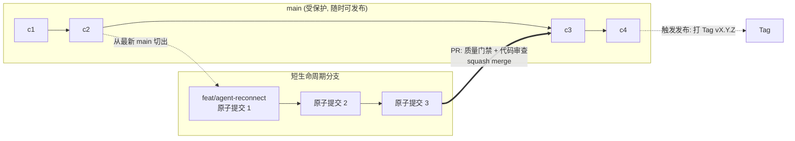

# Git 版本管理规范 (Git Workflow)

本文档定义 **RiriCloud** 的分支模型、提交信息规范与合并策略。版本号递增与发布 Tag 规则见 [VERSIONING.md](./VERSIONING.md)，本文不重复。

---

## 1. 分支模型：GitHub Flow

采用轻量的 GitHub Flow——**`main` 是唯一长期分支，任何时候都保持可发布状态**：



| 规则 | 说明 |
| :--- | :--- |
| **main 受保护** | 禁止直接 push、禁止 force push、禁止删除；只能通过 PR 合入 |
| **短生命周期** | 功能分支存活以「天」为单位，合入即删；长期不合并的分支须定期 rebase main 解决漂移 |
| **随时可发布** | main 上每个提交都必须通过质量门禁（见 [CODE_REVIEW.md](./CODE_REVIEW.md) §2），不引入半成品特性 |
| **未完成功能** | 通过功能开关或按模块渐进合入，而不是长期挂分支 |

> 本项目不使用 Git Flow / release 分支：没有固定发布周期，发布动作就是"在 main 上打 Tag"（见 [VERSIONING.md](./VERSIONING.md) §6）。

---

## 2. 分支命名

格式：`<type>/<scope>-<简短描述>`，描述用小写英文与短横线，总长控制在 40 字符内。

| type | 用途 | 示例 |
| :--- | :--- | :--- |
| `feat` | 新功能 | `feat/server-sub-engine` |
| `fix` | 缺陷修复 | `fix/agent-ws-reconnect` |
| `docs` | 文档 | `docs/code-review-spec` |
| `refactor` | 重构 | `refactor/prisma-service` |
| `chore` | 构建/工具/依赖 | `chore/husky-commitlint` |

`scope` 从 [§3.2](#32-scope-作用域枚举) 的枚举中选取。单人开发也必须遵守命名与提交规范——规范的价值在于让 AI 代理与历史工具（bisect、revert、changelog 生成）始终可依赖。

---

## 3. 提交信息规范 (Conventional Commits)

遵循 [Conventional Commits 1.0.0](https://www.conventionalcommits.org/zh-hans/v1.0.0/)，**type 用英文枚举，描述用中文**。

### 3.1 格式

```
<type>(<scope>): <中文描述>

[可选正文：动机与实现要点，中文]

[可选 footer]
```

- **标题行**不超过 50 个字符（中文按 1 字符计），结尾不加句号。
- 正文说明「为什么」，不重复 diff 能看出的「是什么」。

```text
feat(server): 实现多格式订阅生成引擎

按 User-Agent 与 ?type 参数自动适配 Clash Meta / Sing-box /
Base64 输出，并附带 Subscription-Userinfo 响应头。

Closes #12
```

### 3.2 scope 作用域枚举

| scope | 覆盖范围 |
| :--- | :--- |
| `web` | `apps/web` 前端 |
| `server` | `apps/server` 主控后端 |
| `agent` | `apps/agent` Go 边缘节点守护程序 |
| `db` | Prisma schema、迁移与数据层 |
| `proto` | Master-Agent WS 协议、订阅 URL 契约（跨端联动变更优先用此 scope） |
| `docs` | 文档库 |
| `repo` | 工程配置、CI、构建脚本、依赖升级 |
| （省略） | 仅当确属跨域杂项时才允许省略 scope |

### 3.3 type 枚举

`feat` / `fix` / `docs` / `refactor` / `perf` / `test` / `build` / `ci` / `chore` / `revert`

- 只有 `feat` 和 `fix` 会进入 CHANGELOG 的 `Added` / `Fixed`；其余类型不产生用户可见变更时不写 changelog 条目。
- `chore` 与 `docs` 的区分：改 `docs/` 目录一律 `docs`，改根级工程文件（lint 配置、CI、Dockerfile）一律 `chore(repo)`。

### 3.4 破坏性变更

标题 type 后加 `!`，并在 footer 写明破坏点与迁移方式：

```text
feat(proto)!: 心跳消息增加必填 uptimeMs 字段

BREAKING CHANGE: heartbeat.data 缺失 uptimeMs 的旧 Agent 将被
Master 拒绝。Agent 侧需同步升级到本版本。
```

破坏性变更对应的版本位判定见 [VERSIONING.md](./VERSIONING.md) §2。

### 3.5 原子提交

- 一个提交只做一件事：功能、其配套测试、其文档更新放在**同一个提交**内。
- 禁止"顺手"混入无关格式化或重构；重构与功能严禁同一个提交（便于 revert 与 review）。
- 提交前自查 `git diff --staged`，确保暂存内容与提交信息相符。

---

## 4. 合并与发布操作

| 环节 | 约定 |
| :--- | :--- |
| **合并方式** | 统一 **squash merge**：分支上的多个原子提交压成 main 上的一个提交，提交信息取 PR 标题——因此 PR 标题必须符合 [§3](#3-提交信息规范-conventional-commits) 的格式（PR 标题不规范 = 合并产物不规范） |
| **合并前门禁** | CI 通过 typecheck / lint / test / build 全绿（Go 侧 `go vet` + `gofmt`），详见 [CODE_REVIEW.md](./CODE_REVIEW.md) §2 |
| **冲突处理** | 在功能分支上 `git merge main`（或 rebase 后强推功能分支——仅功能分支允许 force push） |
| **发布** | 在 main 上打附注 Tag `vX.Y.Z`，同步整理 CHANGELOG 的 `[Unreleased]` 小节为版本小节，提交信息 `chore(repo): 发布 vX.Y.Z`（完整流程见 [VERSIONING.md](./VERSIONING.md) §6） |

---

## 5. 禁止事项清单

1. 禁止对 `main` 使用 force push / 或改写其历史。
2. 禁止绕过 PR 门禁直接向 `main` 提交（初始化仓库的首次提交除外）。
3. 禁止在提交信息或 diff 中携带任何密钥、Token、证书私钥（含 `.env` 实文件——`.env.example` 除外）。
4. 禁止合并非绿 CI 的 PR；紧急回滚场景先 `revert` 再修复，不在 main 上"补丁式"直接修改。
5. 禁止一版多义：一个提交同时含 `feat` 与 `fix` 时拆分提交。
