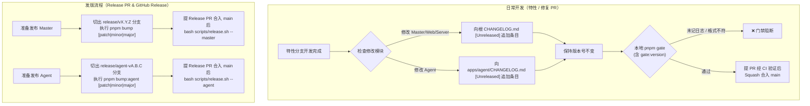

# 版本管理规范 (Versioning)

本文档定义 **RiriCloud** 的版本号规则、递增原则与发布流程。所有参与开发的贡献者（人类与 AI 代理）在提合并、打 Tag、写 CHANGELOG 时都必须遵守本规范。

---

## 1. 语义化版本 (SemVer) 基础

版本号格式为 `MAJOR.MINOR.PATCH`（遵循 [SemVer 2.0.0](https://semver.org/lang/zh-CN/)）：

| 位 | 名称 | 何时递增 |
| :--- | :--- | :--- |
| `MAJOR` | 主版本 | 引入**不兼容的破坏性变更**（API 契约变更、数据库不兼容迁移、WS 协议消息格式破坏等） |
| `MINOR` | 次版本 | 新增**向后兼容**的功能 |
| `PATCH` | 修订版本 | 向后兼容的 **缺陷修复** 或微小的改进 |

递增任何一位时，其右侧所有位归零：`0.2.7` → `0.3.0` → `1.0.0`。

---

## 2. 核心原则：最小递增 (Minimal Bump)

**能升 PATCH 就不升 MINOR，能升 MINOR 就不升 MAJOR。** 版本号是对外契约的承诺，任何夸大的递增都会放大用户的升级成本。

1. **默认动作是 PATCH**：一个变更只要没有引入新能力、没有破坏任何既有行为，就一律按 PATCH 递增。修文案、调样式、优化日志、重构内部实现均属此类。
2. **MINOR 只在「用户可感知的新能力」时递增**：新增 API 端点、新增订阅输出格式、面板新增页面、WS 协议新增消息类型（且旧 Agent 能安全忽略）。
3. **MAJOR 只在「不升级就坏」时递增**：破坏 REST/WS 协议兼容、Prisma 迁移需要人工介入、配置文件格式不兼容导致旧 Agent 无法工作、统一版本号策略下的任一子应用发生破坏性变更（见 §4）。
4. **拿不准时的裁决顺序**：按 PATCH → MINOR → MAJOR 的顺序逐级自查，最低满足者即为答案；仍无法判断时在 PR 中提出讨论，而非直接选高版本。

### 2.1 0.x 阶段的特殊规则

- 项目起步版本为 **`0.1.0`**，表示"已具备可运行的基础形态，但 API 尚不稳定"。
- 依据 SemVer 官方语义，`0.x` 阶段的 **MINOR 递增允许包含破坏性变更**（`0.x` 的 MINOR 等价于 1.0 之后的 MAJOR）。因此 0.x 期间的破坏性变更升 MINOR 而非 MAJOR，但仍必须：
  - 在 commit 中标注 `BREAKING CHANGE` footer；
  - 在 [CHANGELOG.md](../CHANGELOG.md) 中明确写出破坏点与迁移方式。
- **`1.0.0` 的触发条件**（满足其一即应规划 1.0）：
  - Master-Agent WS 协议与 REST API 契约进入冻结期，开始承诺向后兼容；
  - 系统已在生产环境持续运行且完成 Phase 5 端到端验收（见 [ROADMAP.md](./ROADMAP.md)）。

---

## 3. 双轨解耦版本号策略 (Master & Agent Decoupling)

为了兼顾主控系统的快速迭代与边缘节点守护程序的稳定性，RiriCloud 采用 **Master 与 Agent 解耦的双轨独立版本管理体系**：

1. **Master 体系（Server + Web + 控制面）**：
   - **版本源**：根目录 `package.json` 的 `version` 字段。
   - **更新日志**：根目录 `CHANGELOG.md`。
   - **自增命令**：`pnpm bump [patch|minor|major]`。
   - **Git Tag**：`vX.Y.Z`（如 `v0.6.14`）。
2. **Agent 体系（Go 守护程序 + TUI 控制台）**：
   - **版本源**：`apps/agent/VERSION` 文件（纯文本 `A.B.C`）。
   - **更新日志**：`apps/agent/CHANGELOG.md`。
   - **自增命令**：`pnpm bump:agent [patch|minor|major]`。
   - **Git Tag**：`agent-vA.B.C`（如 `agent-v0.6.14`）。
3. **协同契约与暴露方式**：
   - **Server 暴露**：`GET /api/v1/system/version` 返回 `{ version: string, agentVersion: string, agentImage: string }`，同时感知主控版本、内置/推荐 Agent 版本与 Docker 镜像。
   - **Agent 注入**：Go 构建脚本优先读取 `apps/agent/VERSION`，通过 `-ldflags "-X main.Version=${agent_version}"` 注入，运行时随心跳上报。
   - **兼容承诺**：Master 的 WebSocket Gateway 与配置下发层保证对历史稳定版本 Agent 的协议向后兼容；破坏性协议变更须协同规划。

| 事项 | Master 约定 | Agent 约定 |
| :--- | :--- | :--- |
| **版本源** | 根 `package.json` (`version`) | `apps/agent/VERSION` |
| **日志缓冲** | 根 `CHANGELOG.md` 的 `[Unreleased]` | `apps/agent/CHANGELOG.md` 的 `[Unreleased]` |
| **自增命令** | `pnpm bump` (`patch`/`minor`/`major`) | `pnpm bump:agent` (`patch`/`minor`/`major`) |
| **发布 Tag** | `vX.Y.Z` | `agent-vA.B.C` |
| **发布命令** | `bash scripts/release.sh --master` | `bash scripts/release.sh --agent` |
| **README 徽标** | 跟踪 Master 版本 | — |

---

## 4. 变更影响面速查表

发布前用下表快速判断本次应递增的版本位：

| 变更内容 | 版本位 | 作用目标 |
| :--- | :--- | :--- |
| Bug 修复、UI 微调、日志/注释、内部重构、依赖安全升级 | PATCH | 对应模块（Master 或 Agent） |
| 新增 API 端点 / WS 消息类型（旧 Agent 可安全忽略） | MINOR | Master |
| 新增节点协议类型、新增订阅输出格式 | MINOR | Master |
| Agent 新增 CLI 子命令、探针协议支持、TUI 视图增强 | MINOR | Agent |
| 新增数据库表 / 字段（含可回滚的自动迁移） | MINOR | Master |
| 数据库字段删除或语义变更、WS 消息格式破坏性调整 | MAJOR（1.0 前：MINOR + BREAKING CHANGE 标注） | 相应破坏方 |
| 仅文档、脚本、CI 变更 | **不发布**，不打 Tag | — |

---

## 5. Git Tag 与 CHANGELOG 规范

1. **Tag 命名**：
   - Master 使用 `v{version}`（如 `v0.6.14`）；
   - Agent 使用 `agent-v{version}`（如 `agent-v0.6.14`）。
   - 均采用附注 Tag（`git tag -a`），仅在 `main` 分支上打。
2. **Tag 与 CHANGELOG 一一对应**：
   - 每个 Master Tag 对应根目录 `CHANGELOG.md` 中的版本小节；
   - 每个 Agent Tag 对应 `apps/agent/CHANGELOG.md` 中的版本小节。
3. **CHANGELOG 遵循 [Keep a Changelog](https://keepachangelog.com/zh-CN/1.1.0/)**，变更归类为 `Added` / `Changed` / `Fixed` / `Removed` / `Security` / `Deprecated`。
4. **日常 PR 维护对应 `[Unreleased]` 缓冲区**：
   - 修改 `apps/server/`、`apps/web/` 等主控代码时，向根 `CHANGELOG.md` 顶部的 `## [Unreleased]` 追加条目；
   - 修改 `apps/agent/` 代码时，向 `apps/agent/CHANGELOG.md` 顶部的 `## [Unreleased]` 追加条目；
   - PR 开发期间保持各自版本号不变。
5. **发版时统一 Bump 固化**：
   - 发版 Master 时拉出 `release/vX.Y.Z` 分支执行 `pnpm bump`；
   - 发版 Agent 时拉出 `release/agent-vA.B.C` 分支执行 `pnpm bump:agent`。
   - 脚本自动将 `[Unreleased]` 转化为版本小节并重置空模板。

---

## 6. 版本累积管理与发布流程

采用标准的 **`[Unreleased]` 缓冲累积 + Release PR 独立发版** 工作流：

### 6.1 核心代码判定与免增规则

- **Master 核心路径**：`apps/server/`、`apps/web/`、`prisma/`。变更时必须维护根 `CHANGELOG.md`。
- **Agent 核心路径**：`apps/agent/`（除文档与测试外）。变更时必须维护 `apps/agent/CHANGELOG.md`。
- **免增放行**：纯文档（`docs/`）、开发脚本（`scripts/`）、本地配置微调且不改变运行时逻辑时，`pnpm gate:version` 允许免增放行。

### 6.2 工具链与多重防线

- **辅助命令**：
  - `pnpm bump` / `pnpm bump minor` / `pnpm bump major`：主控版本自增与 CHANGELOG 固化。
  - `pnpm bump:agent` / `pnpm bump:agent:minor` / `pnpm bump:agent:major`：Agent 版本自增与 `apps/agent/CHANGELOG.md` 固化。
- **多重防线**：
  1. **本地质量门禁**：`pnpm gate:version`（严格比对当前分支与基准分支差异，确保改动与更新日志严格对应）。
  2. **CI 门禁阻断**：GitHub Actions PR 阶段双重核查。

### 6.3 正式发布 (Release)

- **Master 发布**：`bash scripts/release.sh --master [vX.Y.Z]`
- **Agent 发布**：`bash scripts/release.sh --agent [agent-vA.B.C]`

## 8. 应用版本与可分发二进制资源版本

RiriCloud 使用两种互不替代的版本生命周期：

| 版本类型 | 来源 | 作用 | 变更条件 |
| :--- | :--- | :--- | :--- |
| Master 应用版本 | 根 `package.json` | 主控面板、API 与完整系统版本 | 通过 `pnpm bump` 统一变更 |
| Agent 程序版本 | `apps/agent/VERSION` | 边缘守护程序与 TUI 控制台版本 | 通过 `pnpm bump:agent` 独立变更 |
| 二进制资源版本 | `BinaryRelease.upstreamVersion + revision` | Sing-box/Agent 可分发文件的逻辑资源版本 | 真实二进制、构建标签或兼容约束变化时创建新资源 |

构建脚本约定：`--version` 用于指定构建版本，主控 Docker 镜像打标使用 Master 版本；Agent Docker 镜像使用 Agent 版本；资源 manifest 明确记录各自独立的版本信息。
