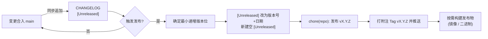

# 版本管理规范 (Versioning)

本文档定义 **RiriCloud** 的版本号规则、递增原则与发布流程。所有参与开发的贡献者（人类与 AI 代理）在提合并、打 Tag、写 CHANGELOG 时都必须遵守本规范。

---

## 1. 语义化版本 (SemVer) 基础

版本号格式为 `MAJOR.MINOR.PATCH`（遵循 [SemVer 2.0.0](https://semver.org/lang/zh-CN/)）：

| 位 | 名称 | 何时递增 |
| :--- | :--- | :--- |
| `MAJOR` | 主版本 | 引入**不兼容的破坏性变更**（API 契约变更、数据库不兼容迁移、WS 协议消息格式破坏等） |
| `MINOR` | 次版本 | 新增**向后兼容**的功能 |
| `PATCH` | 修订版本 | 向后兼容的 **缺陷修复** 或微小的改进 |

递增任何一位时，其右侧所有位归零：`0.2.7` → `0.3.0` → `1.0.0`。

---

## 2. 核心原则：最小递增 (Minimal Bump)

**能升 PATCH 就不升 MINOR，能升 MINOR 就不升 MAJOR。** 版本号是对外契约的承诺，任何夸大的递增都会放大用户的升级成本。

1. **默认动作是 PATCH**：一个变更只要没有引入新能力、没有破坏任何既有行为，就一律按 PATCH 递增。修文案、调样式、优化日志、重构内部实现均属此类。
2. **MINOR 只在「用户可感知的新能力」时递增**：新增 API 端点、新增订阅输出格式、面板新增页面、WS 协议新增消息类型（且旧 Agent 能安全忽略）。
3. **MAJOR 只在「不升级就坏」时递增**：破坏 REST/WS 协议兼容、Prisma 迁移需要人工介入、配置文件格式不兼容导致旧 Agent 无法工作、统一版本号策略下的任一子应用发生破坏性变更（见 §4）。
4. **拿不准时的裁决顺序**：按 PATCH → MINOR → MAJOR 的顺序逐级自查，最低满足者即为答案；仍无法判断时在 PR 中提出讨论，而非直接选高版本。

### 2.1 0.x 阶段的特殊规则

- 项目起步版本为 **`0.1.0`**，表示"已具备可运行的基础形态，但 API 尚不稳定"。
- 依据 SemVer 官方语义，`0.x` 阶段的 **MINOR 递增允许包含破坏性变更**（`0.x` 的 MINOR 等价于 1.0 之后的 MAJOR）。因此 0.x 期间的破坏性变更升 MINOR 而非 MAJOR，但仍必须：
  - 在 commit 中标注 `BREAKING CHANGE` footer；
  - 在 [CHANGELOG.md](../CHANGELOG.md) 中明确写出破坏点与迁移方式。
- **`1.0.0` 的触发条件**（满足其一即应规划 1.0）：
  - Master-Agent WS 协议与 REST API 契约进入冻结期，开始承诺向后兼容；
  - 系统已在生产环境持续运行且完成 Phase 5 端到端验收（见 [ROADMAP.md](./ROADMAP.md)）。

---

## 3. 统一版本号策略

Monorepo 中的 `apps/web`、`apps/server`、`apps/agent` **共用同一个版本号，同步发布**。

理由：Master 与 Agent 之间存在 WS 协议与配置下发契约的强耦合，独立版本号会催生一张难以维护的兼容性矩阵；统一版本意味着"同版本号的 Master 与 Agent 一定兼容"这一简单承诺。

| 事项 | 约定 |
| :--- | :--- |
| **唯一版本源** | 根目录 `package.json` 的 `version` 字段，子包 `package.json` 与 `apps/agent` 一律不得私自维护版本号 |
| **Agent 注入** | Go 构建时通过 `-ldflags "-X main.Version=$(node -p "require('./package.json').version")"` 注入，运行时随心跳上报 |
| **Server 暴露** | NestJS 提供只读的 `GET /api/v1/system/version`，返回统一版本号（打包时从根 `package.json` 读取） |
| **Web 展示** | 前端构建时由 Vite `define` 注入，在管理台"系统信息"中展示 |

---

## 4. 变更影响面速查表

发布前用下表快速判断本次应递增的版本位：

| 变更内容 | 版本位 |
| :--- | :--- |
| Bug 修复、UI 微调、日志/注释、内部重构、依赖安全升级 | PATCH |
| 新增 API 端点 / WS 消息类型（旧 Agent 可安全忽略） | MINOR |
| 新增节点协议类型、新增订阅输出格式 | MINOR |
| 新增数据库表 / 字段（含可回滚的自动迁移） | MINOR |
| 数据库字段删除或语义变更、WS 消息格式破坏性调整 | MAJOR（1.0 前：MINOR + BREAKING CHANGE 标注） |
| 更换核心框架 / 技术栈（见 [PROJECT_CONSTRAINTS.md](./PROJECT_CONSTRAINTS.md)） | MAJOR + 专项 RFC |
| 仅文档、脚本、CI 变更 | **不发布**，不打 Tag |

---

## 5. Git Tag 与 CHANGELOG 规范

1. **Tag 格式**：`v{version}`（如 `v0.1.0`、`v1.2.3`），采用附注 Tag（`git tag -a`），仅在 `main` 分支上打。
2. **Tag 与 CHANGELOG 一一对应**：每个版本 Tag 必须对应 [CHANGELOG.md](../CHANGELOG.md) 中的一个版本小节；反之每个版本小节发布时必须打 Tag。两者任一缺失视为发布流程不完整。
3. **CHANGELOG 遵循 [Keep a Changelog](https://keepachangelog.com/zh-CN/1.1.0/)**，变更归类为 `Added` / `Changed` / `Fixed` / `Removed` / `Security` / `Deprecated`。
4. **条目随 PR 写入**：功能或修复合并进 `main` 时，作者同步在该文件的 `[Unreleased]` 小节追加条目（发布流程详见 [GIT_WORKFLOW.md](./GIT_WORKFLOW.md) §4）。
5. 一个版本小节内的条目按"对用户的重要性"排序，而非时间顺序。

---

## 6. 发布流程 (Release Process)

GitHub Flow 之下不设 release 分支，发布即"打 Tag + 出变更日志"：

要点：

- **触发时机**：积累了足够的用户可感知变更，或存在需要尽快送达的修复（含安全修复）。没有固定周期，避免为凑版本而发布。
- **发布提交**：`chore(repo): 发布 vX.Y.Z`，内容为 CHANGELOG 版本小节整理。
- **回滚**：优先前滚（`fix` + PATCH）；确需回退时删除 Tag 重新发布，并在 CHANGELOG 中记录 `Removed`/`Fixed` 说明。
