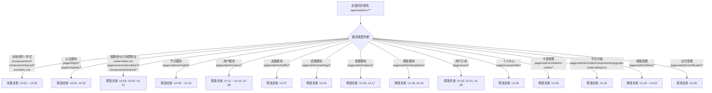

# 前端 UI 视觉验证规范与索引台账 (UI Visual Verification Guidelines & Matrix)

本文档定义 **RiriCloud** 前端（`apps/web`）的 UI 视觉验证标准、全量 UI 索引矩阵、变更感知映射规则与 Antigravity 环境下的标准操作规程 (SOP)。

---

## 1. 核心原则与执行策略

1. **按需触发原则 (On-Demand Only)**：
   - 视觉验证**严禁**作为自动化 CI、Git Pre-commit 钩子或常规门禁（`pnpm gate`）的自动检查项；
   - 仅在**用户提出明确视觉走查要求**（例如：“进行一次视觉验证”、“检查 UI 改动效果”、“验证暗黑模式外观”等）时启动。
2. **环境严格限定 (Antigravity Environment Only)**：
   - 视觉验证依赖 Antigravity 提供的专属浏览器自动化（Chrome DevTools MCP）、视口渲染与截屏归档能力；
   - **禁止**在项目中引入 Cypress、Playwright 等重型本地端到端测试依赖，确保零环境污染与轻量极简。
3. **双主题全覆盖 (Dual Themes Mandatory)**：
   - 任何涉及视觉走查的页面/模态组件，必须同时在 **浅色模式 (Light Mode)** 与 **深色模式 (Dark Mode)** 下进行对比验证。
4. **标准化结果交付 (Standardized Artifact Delivery)**：
   - 每次走查完成后，必须输出结构化的 Markdown 报告 Artifact（含受影响变更项高亮、Carousel 截图对比轮播、检查点通过表）。
5. **移动视口覆盖 (Mobile Viewport Coverage)**：
   - 涉及全局布局、Sidebar、Sheet、Table 或页面响应式样式的变更，走查时增加 `375x812` 手机视口与 `768x1024` 平板视口。
   - 手机视口必须确认页面主体无横向溢出；表格仅在表格容器内横向滚动，复杂表单使用全高 Sheet。

---

## 2. 全量 UI 验证索引台账 (UI Verification Matrix)

系统内所有页面、交互模态框及全局组件均纳管于以下索引台账中：

| 索引编号 | 模块分类 | 页面 / 交互单元 | 路由 / 触发方式 | 对应源码路径 | 核心验证检查点 |
| :--- | :--- | :--- | :--- | :--- | :--- |
| **`UI-01`** | 认证 | 登录页面 | `/login` | `apps/web/src/pages/login/**` | 卡片居中性、Logo 渲染、可选副标题不展示默认开发文案、邮箱/密码正式占位提示、输入框聚焦态、登录后跳转与错误 Toast |
| **`UI-02`** | 认证 | 注册页面 | `/register` | `apps/web/src/pages/register/**` | 表单字段对齐、可选副标题不展示默认开发文案、邮箱/密码正式占位提示、密码确认校验、返回登录跳转链接 |
| **`UI-03`** | 控制台 | 根路径重定向 | `/` | `apps/web/src/router/index.tsx` | 登录后访问根路径使用 replace 自动跳转至 `/subscription`，不渲染已下线的仪表盘页面 |
| **`UI-04`** | 用户订阅 | 公告与客户端使用指引 | `/subscription` | `apps/web/src/components/shared/announcement-card.tsx`, `apps/web/src/components/shared/client-guide-card.tsx` | 公告 Markdown 安全渲染、关闭状态本地记忆、无订阅与有订阅状态下均展示客户端三步指引，明暗主题与移动端不溢出 |
| **`UI-05`** | 节点管理 | 节点管理列表 | `/admin/nodes` | `apps/web/src/pages/admin/nodes/index.tsx` | 节点数据表格、内核运行状态 Badge、CPU/内存/带宽遥测实时刷新、心跳时间 |
| **`UI-06`** | 节点管理 | 添加节点弹窗 | `/admin/nodes`（点击“添加节点”） | `apps/web/src/pages/admin/nodes/components/node-form-dialog.tsx` | Dialog 居中、服务器地址与名称输入框、公开开关 Switch |
| **`UI-07`** | 节点详情 | 线路承载与角色列表 Tab | `/admin/nodes/:id` (Tab 1) | `apps/web/src/pages/admin/nodes/detail.tsx` | 当前承载线路、协议徽章、入口/出口角色、入口/出口端口与线路状态 |
| **`UI-08`** | 节点详情 | 派生监听端口卡片 | `/admin/nodes/:id` (Tab 1) | `apps/web/src/pages/admin/nodes/detail.tsx` | 线路派生端口按角色展示、端口文本不溢出、无线路时 EmptyState |
| **`UI-09`** | 节点详情 | 基础信息与遥测 Tab | `/admin/nodes/:id` (Tab 2) | `apps/web/src/pages/admin/nodes/detail.tsx` | 节点基础信息编辑、Agent Token、通信模式、Agent/系统架构/内核版本画像、遥测与内核状态 |
| **`UI-10`** | 节点详情 | 高级与运维 Tab | `/admin/nodes/:id` (Tab 3) | `apps/web/src/pages/admin/nodes/detail.tsx` | Line 配置预览、JSON 覆盖编辑器、网络质量快照、格式化内核错误日志、重启/升级/删除操作 |
| **`UI-11`** | 用户管理 | 一站式用户管理列表 | `/admin/users` | `apps/web/src/pages/admin/users/index.tsx` | 邮箱实时搜索、角色/账号状态/订阅状态/套餐筛选、套餐 Badge、订阅状态 Badge、流量进度条、到期日、流量数据自动刷新、Token 重置确认、管理员防误操作保护 |
| **`UI-12`** | 用户管理 | 创建用户弹窗 | `/admin/users`（点击“创建用户”） | `apps/web/src/pages/admin/users/components/user-form-dialog.tsx` | 邮箱、初始密码、角色选择器、可选初始套餐 Select、无套餐创建、套餐联动配额与有效期、永久有效 Switch 卡片与配额输入框高度/阴影一致 |
| **`UI-13`** | 用户管理 | 综合编辑用户弹窗 | `/admin/users`（点击操作列“编辑”） | `apps/web/src/pages/admin/users/components/user-form-dialog.tsx` | 「账号安全/订阅管理」双 Tab、角色与封禁、密码重置、套餐/无套餐/状态/配额/已用流量调整、启用账号卡片与角色 Select 高度/阴影一致、无套餐危险操作确认、Token 重置确认 |
| **`UI-14`** | 系统设置 | 系统设置五分类管理面板 | `/admin/settings` | `apps/web/src/pages/admin/settings/index.tsx` | 五个 Tab 响应式切换与 16px 图标、品牌/注册/订阅/Agent/高级字段、全站访问 URL 与当前面板地址快捷填充、Nginx 短链开关及配置提示、套餐与模板回填、CodeMirror、保存与重置确认 |
| **`UI-15`** | 全局框架 | 动态品牌外壳与主题切换 | 全局 Layout / Header / Sidebar | `apps/web/src/components/layout/**`, `apps/web/src/lib/public-settings.ts` | 站点名/Logo、页脚客服入口、动态标题/Favicon/CSS、侧边栏定位、版本号展示、主题三态切换、Sonner Toast 浮层 |
| **`UI-16`** | 套餐管理 | 套餐管理列表 | `/admin/plans` | `apps/web/src/pages/admin/plans/index.tsx` | 套餐卡片信息密度、公开/下架 Badge、节点匹配与模板标签、删除确认 |
| **`UI-17`** | 套餐管理 | 套餐创建/编辑弹窗 | `/admin/plans`（点击“新建套餐/编辑”） | `apps/web/src/pages/admin/plans/components/plan-form-dialog.tsx` | 配额/期限数值输入、匹配模式 Select、模板选择、公开 Switch、移动端滚动 |
| **`UI-18`** | 模板管理 | 订阅模板列表 | `/admin/templates` | `apps/web/src/pages/admin/templates/index.tsx` | 默认模板 Badge、策略组/规则集/DNS 摘要、删除确认 |
| **`UI-19`** | 模板管理 | 订阅模板编辑弹窗 | `/admin/templates`（点击“新建模板/编辑”） | `apps/web/src/pages/admin/templates/components/template-form-dialog.tsx` | JSON/YAML 等宽编辑区、校验错误、默认模板 Switch、弹窗滚动 |
| **`UI-20`** | 用户订阅 | 套餐市场 | `/market` | `apps/web/src/pages/user/market/index.tsx` | 套餐权益网格、当前套餐标记、低价套餐禁止直接降级、订购/升配二次确认、窄屏单列 |
| **`UI-21`** | 用户订阅 | 我的订阅综合控制台 | `/subscription` | `apps/web/src/pages/user/subscription/index.tsx` | 公告下方按状态渲染订阅主体或开通引导；有订阅时展示流量进度、状态 Badge、标准/伪静态 Token URL 复制/重置、取消保留权益提示、可用线路紧凑列表（名称/协议/在线状态/倍率）；无订阅时展示前往套餐市场按钮；小型确认弹窗在移动端保持圆角、左右留白、居中紧凑且 Footer 横向排列 |
| **`UI-22`** | 节点运维 | 远程升级弹窗 | `/admin/nodes/:id`（点击“升级中心”） | `apps/web/src/pages/admin/nodes/components/upgrade-node-dialog.tsx` | 当前/推荐版本对比、主控内置来源、自定义 URL/SHA-256 校验、导入主控、HTTP/WS 任务等待、下发中禁用状态、错误 Toast |
| **`UI-23`** | 线路管理 | 线路管理列表 | `/admin/lines` | `apps/web/src/pages/admin/lines/index.tsx` | 类型/状态/标签筛选、排序、批量启停、倍率/中继信息、覆盖启用状态、删除确认 |
| **`UI-24`** | 线路管理 | 新建/编辑线路双页签弹窗 | `/admin/lines`（点击“新建线路/编辑线路”） | `apps/web/src/pages/admin/lines/components/line-form-dialog.tsx` | 默认“入站配置”页签包含协议/入口节点/监听地址与端口、平面展开的 Transport/TLS/Reality/ACME/专属参数、标准 TLS/ACME 的 ALPN 预设多选、ShadowTLS v3 + SS2022 内层字段、可增删请求头、Reality 密钥生成；Reality 不显示 ALPN；“线路高级设置”页签包含出口拓扑、覆盖/倍率/状态并统一保存 |
| **`UI-26`** | 证书管理 | 证书管理列表与证书操作弹窗 | `/admin/certificates`（点击新建/编辑/查看） | `apps/web/src/pages/admin/certificates/**` | 证书名称、SAN 标签、签发者、有效期状态、关联线路数、PEM 粘贴/上传、解析反馈、私钥查看、引用线路删除拦截 |
| **`UI-27`** | 流量统计 | 全站流量统计 | `/admin/traffic` | `apps/web/src/pages/admin/traffic/**` | 今日/24 小时/7 天/30 天 Tabs、流量与当前速率摘要、平均/峰值速率图、线路 Donut 图、排行表格、明暗主题与移动端局部横向滚动 |
| **`UI-28`** | 用户管理 | 单用户流量明细下钻 | `/admin/users`（点击操作列“流量明细”） | `apps/web/src/pages/admin/users/components/user-traffic-dialog.tsx` | 用户配额画像、周期走势图、线路占比、明细表格、无记录 EmptyState、桌面 Dialog/移动 Sheet、明暗主题 |
| **`UI-29`** | 用户中心 | 个人中心 | `/profile` | `apps/web/src/pages/user/profile/**`, `apps/web/src/components/shared/quick-redeem-form.tsx` | 余额与收支摘要、卡密兑换、流水分页、密码修改、用户代理凭据展示/复制与重置确认；移动端单列、流水表格保持完整字段与可读列宽并在容器内横向滚动、明暗主题 |
| **`UI-30`** | 卡密管理 | 卡密管理列表与批量生成/作废交互 | `/admin/redeem-codes` | `apps/web/src/pages/admin/redeem-codes/**` | 状态筛选、元/分单位提示、批量生成表单、生成结果换行复制、有效期状态、未使用卡密作废确认、移动端表格局部滚动与弹窗内滚动 |

---

### 2.1 移动端附加检查项

所有受影响索引在 `375x812` 与 `768x1024` 下追加检查：

- 页面主体、卡片和 Header 不产生非预期横向滚动。
- 移动端 Sidebar 能打开、关闭，并在导航后自动收起。
- 普通弹窗保留两侧留白并可在内部滚动，复杂编辑弹窗切换为全高 Sheet。
- 表格完整保留字段，横向滚动限制在表格容器内。
- Tabs、筛选器、批量操作和危险操作按钮不重叠、不被裁切。

---

## 3. Git Diff 变更映射与走查范围判定

当开发者或 AI Agent 修改前端代码时，应根据改动文件的路径映射确定受影响的 UI 索引范围：

### 映射规则表

| 修改的代码路径 (Glob Pattern) | 关联受影响的 UI 索引 | 走查级别 |
| :--- | :--- | :---: |
| `apps/web/src/index.css`, `tailwind.config.js` | `UI-01` ~ `UI-30`（全站所有页面） | **全量** |
| `apps/web/src/components/layout/**`, `theme-toggle.tsx` | `UI-01` ~ `UI-30`（全局框架与主题） | **全量** |
| `apps/web/src/components/ui/**` | 依赖该原子组件的所有页面 | **全量 / 宽范围** |
| `apps/web/src/pages/login/**`, `register/**` | `UI-01`, `UI-02` | **增量** |
| `apps/web/src/router/index.tsx` | `UI-03`, `UI-21` | **增量** |
| `apps/web/src/pages/admin/nodes/**` | `UI-05`, `UI-06`, `UI-07`, `UI-08`, `UI-09`, `UI-10` | **增量** |
| `apps/web/src/pages/admin/users/**` | `UI-11`, `UI-12`, `UI-13`, `UI-28` | **增量** |
| `apps/web/src/pages/admin/traffic/**` | `UI-27` | **增量** |
| `apps/web/src/pages/admin/settings/**` | `UI-14` | **增量** |
| `apps/web/src/lib/subscription-url.ts` | `UI-03`, `UI-14`, `UI-21` | **增量** |
| `apps/web/src/components/layout/site-runtime.tsx`, `apps/web/src/lib/public-settings.ts` | `UI-01` ~ `UI-03`, `UI-14`, `UI-15`, `UI-21` | **增量** |
| `apps/web/src/pages/admin/plans/**` | `UI-16`, `UI-17` | **增量** |
| `apps/web/src/pages/admin/templates/**` | `UI-18`, `UI-19` | **增量** |
| `apps/web/src/pages/user/**` | `UI-20`, `UI-21`, `UI-29` | **增量** |
| `apps/web/src/components/shared/announcement-card.tsx`, `client-guide-card.tsx` | `UI-04`, `UI-21` | **增量** |
| `apps/web/src/pages/user/profile/**`, `apps/web/src/components/shared/quick-redeem-form.tsx` | `UI-29` | **增量** |
| `apps/web/src/pages/admin/redeem-codes/**` | `UI-30` | **增量** |
| `apps/web/src/pages/admin/nodes/components/upgrade-node-dialog.tsx` | `UI-22` | **增量** |
| `apps/web/src/pages/admin/lines/**` | `UI-23`, `UI-24` | **增量** |
| `apps/web/src/pages/admin/certificates/**` | `UI-26` | **增量** |

---

## 4. Antigravity 视觉走查标准操作规程 (SOP)

当用户发出视觉验证指令后，AI Agent 需按以下标准步骤执行：

### Step 1: 环境检查与就绪
1. 确认后端服务（`http://localhost:3000`）与前端服务（`http://localhost:5173`）正常监听；
2. 确保数据库已初始化并完成本地演示 seed（默认管理员账号：`admin@riricloud.local`，密码：`riri-admin-demo`）；生产环境使用 `.env` 中显式配置的管理员凭据，不依赖演示默认值。

### Step 2: 浏览器视口与会话初始化
1. 依次将浏览器页面视口调整至 `1440x900`、`375x812` 和 `768x1024`；
2. 导航至 `http://localhost:5173/login`，使用管理员账号登录进入主控面板。

### Step 3: 按判定范围遍历 UI 矩阵
1. 根据 Git Diff 确定的待验证索引范围（增量或全量），依次导航或触发对应的页面及模态框；
2. 对每个目标视图，执行浅色模式 (Light) 与深色模式 (Dark) 的截屏捕获。

### Step 4: 检查点与视觉规范核对
对照 [docs/FRONTEND_UI_GUIDELINES.md](FRONTEND_UI_GUIDELINES.md) 核实以下核心要素：
- [ ] **排版与边距**：容器间距均匀，无内容溢出或非预期换行；
- [ ] **弹窗尺寸**：普通表单宽度统一，复杂编辑弹窗保持适度宽度，移动端有两侧留白且超长内容可在弹窗内滚动；
- [ ] **移动端交互**：Sidebar 抽屉可开关，导航后自动收起；Sheet、Tabs、筛选器和表格在 `375x812` 下可操作；
- [ ] **横向滚动边界**：页面主体无横向溢出，宽表格只在其自身容器内滚动；
- [ ] **语义颜色**：文字与背景对比度合格，无硬编码 HEX 色彩或色彩失真；
- [ ] **组件规范**：全部使用 shadcn/ui 组件，无原生裸 HTML 交互标签；
- [ ] **无障碍与交互**：模态框遮罩层正确显示，支持 Escape 键关闭与焦点捕获；
- [ ] **主题切换**：明暗主题切换流畅，无残留白色/黑色色块。

### Step 5: 输出标准化验证报告 Artifact
在当前对话 Artifact 目录生成 `ui_visual_verification_report.md`，使用 `carousel` 标签嵌入全量/增量走查对比截图，并列出各检查点通过状态表。

---

## 5. 维护与更新约定

1. **新增页面/模态框时**：必须在同一 PR 中向本文件「2. 全量 UI 验证索引台账」追加新的 `UI-xx` 索引项与源码路径映射；当前套餐/订阅相关视图登记为 `UI-16` 至 `UI-24`，用户中心与卡密管理登记为 `UI-29` 至 `UI-30`，管理员订阅履约已归入用户管理的 `UI-11` 至 `UI-13`。
2. **重构/删除页面时**：必须同步更新索引台账，保持文档与代码绝对一致。
