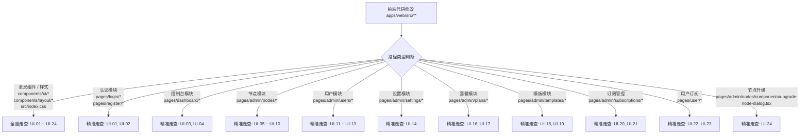

# 前端 UI 视觉验证规范与索引台账 (UI Visual Verification Guidelines & Matrix)

本文档定义 **RiriCloud** 前端（`apps/web`）的 UI 视觉验证标准、全量 UI 索引矩阵、变更感知映射规则与 Antigravity 环境下的标准操作规程 (SOP)。

---

## 1. 核心原则与执行策略

1. **按需触发原则 (On-Demand Only)**：
   - 视觉验证**严禁**作为自动化 CI、Git Pre-commit 钩子或常规门禁（`pnpm gate`）的自动检查项；
   - 仅在**用户提出明确视觉走查要求**（例如：“进行一次视觉验证”、“检查 UI 改动效果”、“验证暗黑模式外观”等）时启动。
2. **环境严格限定 (Antigravity Environment Only)**：
   - 视觉验证依赖 Antigravity 提供的专属浏览器自动化（Chrome DevTools MCP）、视口渲染与截屏归档能力；
   - **禁止**在项目中引入 Cypress、Playwright 等重型本地端到端测试依赖，确保零环境污染与轻量极简。
3. **双主题全覆盖 (Dual Themes Mandatory)**：
   - 任何涉及视觉走查的页面/模态组件，必须同时在 **浅色模式 (Light Mode)** 与 **深色模式 (Dark Mode)** 下进行对比验证。
4. **标准化结果交付 (Standardized Artifact Delivery)**：
   - 每次走查完成后，必须输出结构化的 Markdown 报告 Artifact（含受影响变更项高亮、Carousel 截图对比轮播、检查点通过表）。

---

## 2. 全量 UI 验证索引台账 (UI Verification Matrix)

系统内所有页面、交互模态框及全局组件均纳管于以下索引台账中：

| 索引编号 | 模块分类 | 页面 / 交互单元 | 路由 / 触发方式 | 对应源码路径 | 核心验证检查点 |
| :--- | :--- | :--- | :--- | :--- | :--- |
| **`UI-01`** | 认证 | 登录页面 | `/login` | `apps/web/src/pages/login/**` | 卡片居中性、Logo 渲染、输入框聚焦态、登录后跳转与错误 Toast |
| **`UI-02`** | 认证 | 注册页面 | `/register` | `apps/web/src/pages/register/**` | 表单字段对齐、密码确认校验、返回登录跳转链接 |
| **`UI-03`** | 控制台 | 仪表盘概览 | `/` | `apps/web/src/pages/dashboard/**` | 流量配额卡片、节点在线数、流量使用进度条、可用节点表格与协议 Badge |
| **`UI-04`** | 控制台 | 重置订阅确认弹窗 | `/`（点击“重置链接”） | `apps/web/src/components/ui/alert-dialog.tsx` | AlertDialog 遮罩、警告文案、危险红色按钮、取消/确认交互 |
| **`UI-05`** | 节点管理 | 节点管理列表 | `/admin/nodes` | `apps/web/src/pages/admin/nodes/index.tsx` | 节点数据表格、内核运行状态 Badge、CPU/内存/带宽遥测实时刷新、心跳时间 |
| **`UI-06`** | 节点管理 | 添加节点弹窗 | `/admin/nodes`（点击“添加节点”） | `apps/web/src/pages/admin/nodes/components/node-form-dialog.tsx` | Dialog 居中、服务器地址与名称输入框、公开开关 Switch |
| **`UI-07`** | 节点详情 | 入站协议列表 Tab | `/admin/nodes/:id` (Tab 1) | `apps/web/src/pages/admin/nodes/detail.tsx` | 入站协议列表表格、Tag 徽章、监听端口显示、公开/隐藏状态 Badge |
| **`UI-08`** | 节点详情 | 添加入站协议弹窗 | `/admin/nodes/:id`（点击“添加入站”） | `apps/web/src/pages/admin/nodes/components/inbound-form-dialog.tsx` | 协议下拉选择、传输层 Transport 配置、TLS/Reality 密钥对一键生成、流控设置 |
| **`UI-09`** | 节点详情 | 基础信息与接入 Tab | `/admin/nodes/:id` (Tab 2) | `apps/web/src/pages/admin/nodes/detail.tsx` | 节点基础信息编辑、Agent 接入 Token 展示与一键复制、遥测卡片 |
| **`UI-10`** | 节点详情 | 高级模式 Tab | `/admin/nodes/:id` (Tab 3) | `apps/web/src/pages/admin/nodes/detail.tsx` | sing-box 服务端生成配置只读预览、JSON 覆盖深合并代码编辑器 |
| **`UI-11`** | 用户管理 | 用户管理列表 | `/admin/users` | `apps/web/src/pages/admin/users/index.tsx` | 邮箱实时搜索、列显示下拉、用户用量进度条、状态 Badge、分页器、管理员防误操作保护 |
| **`UI-12`** | 用户管理 | 创建用户弹窗 | `/admin/users`（点击“创建用户”） | `apps/web/src/pages/admin/users/components/user-form-dialog.tsx` | 邮箱、初始密码、角色选择器、配额（GB）数值输入框、永久有效 Switch |
| **`UI-13`** | 用户管理 | 编辑用户弹窗 | `/admin/users`（点击操作列“编辑”） | `apps/web/src/pages/admin/users/components/user-form-dialog.tsx` | 角色修改、流量配额调整、启用/封禁账号 Switch、重置密码输入框 |
| **`UI-14`** | 系统设置 | 系统设置页面 | `/admin/settings` | `apps/web/src/pages/admin/settings/index.tsx` | 站点名称输入框、开放注册 Switch、新用户默认配额输入框、保存按钮 |
| **`UI-15`** | 全局框架 | 导航栏与主题切换 | 全局 Layout / Header / Sidebar | `apps/web/src/components/layout/**` | 侧边栏高亮定位、版本号展示、主题三态切换（浅色/深色/跟随系统）、Sonner Toast 浮层 |
| **`UI-16`** | 套餐管理 | 套餐管理列表 | `/admin/plans` | `apps/web/src/pages/admin/plans/index.tsx` | 套餐卡片信息密度、公开/下架 Badge、节点匹配与模板标签、删除确认 |
| **`UI-17`** | 套餐管理 | 套餐创建/编辑弹窗 | `/admin/plans`（点击“新建套餐/编辑”） | `apps/web/src/pages/admin/plans/components/plan-form-dialog.tsx` | 配额/期限数值输入、匹配模式 Select、模板选择、公开 Switch、移动端滚动 |
| **`UI-18`** | 模板管理 | 订阅模板列表 | `/admin/templates` | `apps/web/src/pages/admin/templates/index.tsx` | 默认模板 Badge、策略组/规则集/DNS 摘要、删除确认 |
| **`UI-19`** | 模板管理 | 订阅模板编辑弹窗 | `/admin/templates`（点击“新建模板/编辑”） | `apps/web/src/pages/admin/templates/components/template-form-dialog.tsx` | JSON/YAML 等宽编辑区、校验错误、默认模板 Switch、弹窗滚动 |
| **`UI-20`** | 订阅管控 | 管理订阅列表 | `/admin/subscriptions` | `apps/web/src/pages/admin/subscriptions/index.tsx` | 用户/套餐信息、流量进度、状态语义色、Token 重置确认 |
| **`UI-21`** | 订阅管控 | 管理订阅弹窗 | `/admin/subscriptions`（点击“管理”） | `apps/web/src/pages/admin/subscriptions/components/subscription-edit-dialog.tsx` | 状态/套餐 Select、配额与已用流量、日期和增加天数、提交态 |
| **`UI-22`** | 用户订阅 | 套餐市场 | `/market` | `apps/web/src/pages/user/market/index.tsx` | 套餐权益网格、当前套餐标记、订购/升配二次确认、窄屏单列 |
| **`UI-23`** | 用户订阅 | 我的订阅详情 | `/subscription` | `apps/web/src/pages/user/subscription/index.tsx` | 流量进度、状态 Badge、Token 复制/重置、取消保留权益提示、可用节点 |
| **`UI-24`** | 节点运维 | 远程升级弹窗 | `/admin/nodes/:id`（点击“远程升级”） | `apps/web/src/pages/admin/nodes/components/upgrade-node-dialog.tsx` | 目标 Select、版本/URL/SHA-256 校验、下发中禁用状态、错误 Toast |

---

## 3. Git Diff 变更映射与走查范围判定

当开发者或 AI Agent 修改前端代码时，应根据改动文件的路径映射确定受影响的 UI 索引范围：

### 映射规则表

| 修改的代码路径 (Glob Pattern) | 关联受影响的 UI 索引 | 走查级别 |
| :--- | :--- | :---: |
| `apps/web/src/index.css`, `tailwind.config.js` | `UI-01` ~ `UI-15`（全站所有页面） | **全量** |
| `apps/web/src/components/layout/**`, `theme-toggle.tsx` | `UI-01` ~ `UI-15`（全局框架与主题） | **全量** |
| `apps/web/src/components/ui/**` | 依赖该原子组件的所有页面 | **全量 / 宽范围** |
| `apps/web/src/pages/login/**`, `register/**` | `UI-01`, `UI-02` | **增量** |
| `apps/web/src/pages/dashboard/**` | `UI-03`, `UI-04` | **增量** |
| `apps/web/src/pages/admin/nodes/**` | `UI-05`, `UI-06`, `UI-07`, `UI-08`, `UI-09`, `UI-10` | **增量** |
| `apps/web/src/pages/admin/users/**` | `UI-11`, `UI-12`, `UI-13` | **增量** |
| `apps/web/src/pages/admin/settings/**` | `UI-14` | **增量** |
| `apps/web/src/pages/admin/plans/**` | `UI-16`, `UI-17` | **增量** |
| `apps/web/src/pages/admin/templates/**` | `UI-18`, `UI-19` | **增量** |
| `apps/web/src/pages/admin/subscriptions/**` | `UI-20`, `UI-21` | **增量** |
| `apps/web/src/pages/user/**` | `UI-22`, `UI-23` | **增量** |
| `apps/web/src/pages/admin/nodes/components/upgrade-node-dialog.tsx` | `UI-24` | **增量** |

---

## 4. Antigravity 视觉走查标准操作规程 (SOP)

当用户发出视觉验证指令后，AI Agent 需按以下标准步骤执行：

### Step 1: 环境检查与就绪
1. 确认后端服务（`http://localhost:3000`）与前端服务（`http://localhost:5173`）正常监听；
2. 确保数据库已初始化并完成种子数据填充（默认管理员账号：`admin@riricloud.local`，密码：`riri-admin-demo`）。

### Step 2: 浏览器视口与会话初始化
1. 通过 Chrome DevTools MCP 将浏览器页面视口调整至标准桌面分辨率（如 `1440x900`）；
2. 导航至 `http://localhost:5173/login`，使用管理员账号登录进入主控面板。

### Step 3: 按判定范围遍历 UI 矩阵
1. 根据 Git Diff 确定的待验证索引范围（增量或全量），依次导航或触发对应的页面及模态框；
2. 对每个目标视图，执行浅色模式 (Light) 与深色模式 (Dark) 的截屏捕获。

### Step 4: 检查点与视觉规范核对
对照 [docs/FRONTEND_UI_GUIDELINES.md](FRONTEND_UI_GUIDELINES.md) 核实以下核心要素：
- [ ] **排版与边距**：容器间距均匀，无内容溢出或非预期换行；
- [ ] **语义颜色**：文字与背景对比度合格，无硬编码 HEX 色彩或色彩失真；
- [ ] **组件规范**：全部使用 shadcn/ui 组件，无原生裸 HTML 交互标签；
- [ ] **无障碍与交互**：模态框遮罩层正确显示，支持 Escape 键关闭与焦点捕获；
- [ ] **主题切换**：明暗主题切换流畅，无残留白色/黑色色块。

### Step 5: 输出标准化验证报告 Artifact
在当前对话 Artifact 目录生成 `ui_visual_verification_report.md`，使用 `carousel` 标签嵌入全量/增量走查对比截图，并列出各检查点通过状态表。

---

## 5. 维护与更新约定

1. **新增页面/模态框时**：必须在同一 PR 中向本文件「2. 全量 UI 验证索引台账」追加新的 `UI-xx` 索引项与源码路径映射；本次订阅业务已登记为 `UI-16` 至 `UI-24`。
2. **重构/删除页面时**：必须同步更新索引台账，保持文档与代码绝对一致。
