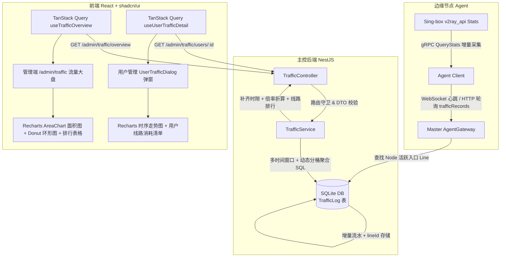

# 管理端线路流量大盘与单用户流量统计实施规划与任务指南

## 🎯 目标与背景

随着 RiriCloud 演进至 `v0.4.5+`，系统已完成控制面/数据面解耦与节点/线路解耦（中继拓扑、多协议支持、流量倍率等）。当前系统在边缘 Agent 通过 Sing-box `v2ray_api` 本地 gRPC StatsService 实现了按心跳周期的用户流量增量采集与扣费，但管理端尚缺乏全局与微观维度的流量可视化大盘：

1. **全站线路流量大盘 (Global Line Traffic Dashboard)**：
   - 在管理端新增独立一级菜单与页面（`/admin/traffic`），提供全站流量维度的深度可视化监控。
   - 支持预置时间维度切换（`今日`、`最近 24 小时`、`最近 7 天`、`最近 30 天`），展示总计费流量、总下行、总上行、活跃线路数与活跃用户数 5 大核心 KPI。
   - 采用 Recharts 双色时序平滑面积图（上传/下载）展示吞吐走势，并提供线路消耗占比环形图（Donut Chart）。
   - 提供线路流量排行榜与明细表格，支持物理原始流量与乘倍率后折算计费流量的清晰对比。
2. **单用户流量明细下钻 (User Traffic Deep-Dive)**：
   - 在管理员「用户管理（`/admin/users`）」表格的操作菜单中增加「流量明细」入口。
   - 点击弹出响应式宽屏模态框/抽屉（`UserTrafficDialog`），展示该用户的额度画像、周期内用量走势图（Area/Bar）、各线路消耗占比与明细清单。
3. **数据链路与时序索引优化**：
   - 扩展 `TrafficLog` 模型支持 `lineId` 线路归属与级联外键，建立 `[recordedAt, lineId]` 及 `[recordedAt, userId]` 复合时序索引。
   - 边缘 Agent 心跳上报流量增量时，Master 自动关联匹配节点的活跃线路并写入 `lineId`，向下完全兼容无 `lineId` 的历史流水数据。
   - 后端基于 SQLite 原生高效动态分桶（<48h 按小时聚合，>=48h 按天聚合），时隙自动连续补零，保证毫秒级查询响应与无缝图表绘制。

---

## 🏗️ 架构设计与端到端数据流

### 1. 数据链路拓扑图



### 2. 线路归属匹配算法 (Line Attribution Algorithm)

当 Agent 心跳携带 `trafficRecords: [{ userUuid, upload, download }]` 上报时，`AgentGatewayService` 执行以下关联逻辑：
1. **查询节点的关联线路**：查询当前 `nodeId` 对应的全部 `entryLines`（入口线路）与 `exitLines`（出口线路）。
2. **确定入库 `lineId`**：
   - 若当前节点作为直连（`DIRECT`）或中继入口（`RELAY` 且 `entryNodeId === nodeId`）存在活跃线路（`status === 'ACTIVE'`）：优先绑定该入口线路 ID；
   - 若存在多条线路，优先按端口与协议匹配（或取首个活跃接入线路）；
   - 若当前节点暂未绑定任何线路（如仅作为中间转发或底座裸机），`lineId` 置为 `null`；
3. **历史数据向下兼容**：聚合查询时，若 `TrafficLog.lineId` 为 `null`，自动通过 `TrafficLog.nodeId` 回查该节点的首选线路名称进行归组，或标记为“未分配线路（节点直连）”，确保历史流水不丢失。

---

## 💾 数据模型与数据库迁移设计

### 1. Prisma Schema 变更 (`apps/server/prisma/schema.prisma`)

```prisma
model TrafficLog {
  id         String   @id @default(uuid())
  nodeId     String
  userId     String
  lineId     String?  // 新增：归属线路 ID（可选，级联置空）
  upload     BigInt   @default(0) // 增量上传字节数
  download   BigInt   @default(0) // 增量下载字节数
  recordedAt DateTime @default(now())

  node Node  @relation(fields: [nodeId], references: [id], onDelete: Cascade)
  user User  @relation(fields: [userId], references: [id], onDelete: Cascade)
  line Line? @relation(fields: [lineId], references: [id], onDelete: SetNull)

  @@index([nodeId])
  @@index([userId])
  @@index([lineId])
  @@index([recordedAt])
  @@index([recordedAt, lineId])
  @@index([recordedAt, userId])
}
```

### 2. 迁移 SQL 说明 (`20260902081811_traffic_line_attribution`)
- 在 `TrafficLog` 表中添加 `lineId TEXT` 列；
- 建立 `TrafficLog(lineId)` 外键约束至 `Line(id)`；
- 创建 `TrafficLog_lineId_idx`、`TrafficLog_recordedAt_lineId_idx`、`TrafficLog_recordedAt_userId_idx` 索引以保障时序区间聚合查询性能。

---

## ⚙️ 后端服务架构与 API 接口契约

### 1. DTO 类型定义 (`apps/server/src/traffic/dto/traffic.dto.ts`)

```typescript
import { IsIn, IsOptional } from 'class-validator';
import { ApiProperty, ApiPropertyOptional } from '@nestjs/swagger';

export type TrafficTimeRange = 'today' | '24h' | '7d' | '30d';

export class QueryTrafficDto {
  @ApiPropertyOptional({ enum: ['today', '24h', '7d', '30d'], default: 'today' })
  @IsOptional()
  @IsIn(['today', '24h', '7d', '30d'])
  range?: TrafficTimeRange = 'today';
}

export interface TrafficTimeSeriesPoint {
  timestamp: string;      // "2026-09-02 14:00" 或 "2026-09-02"
  displayTime: string;    // 友好的 X 轴展示文案（如 "14:00" 或 "09-02"）
  upload: number;         // 周期内原始上行字节数
  download: number;       // 周期内原始下行字节数
  total: number;          // 周期内原始总字节数 (upload + download)
  billedTotal: number;    // 周期内乘倍率后的计费字节数
}

export interface LineTrafficRankItem {
  lineId: string | null;
  lineName: string;
  protocolType?: string;
  lineType?: string;      // DIRECT | RELAY
  trafficRate: number;    // 线路倍率
  upload: number;         // 原始上行字节数
  download: number;       // 原始下行字节数
  total: number;          // 原始总字节数
  billedTotal: number;    // 折算计费字节数 (total * trafficRate)
  percentage: number;     // 占全站/全用户总流量百分比 (0~100)
}

export interface TrafficOverviewResponse {
  timeRange: TrafficTimeRange;
  bucketType: 'hour' | 'day';
  summary: {
    totalUpload: number;        // 全站总上行
    totalDownload: number;      // 全站总下行
    totalPhysical: number;      // 全站总物理流量
    totalBilled: number;        // 全站总计费流量（扣费基准）
    activeLinesCount: number;   // 产生流量的活跃线路数
    totalLinesCount: number;    // 系统总线路数
    activeUsersCount: number;   // 产生流量的活跃用户数
    totalUsersCount: number;    // 系统总用户数
  };
  timeSeries: TrafficTimeSeriesPoint[];
  lineRankings: LineTrafficRankItem[];
}

export interface UserTrafficDetailResponse {
  userId: string;
  email: string;
  role: string;
  isActive: boolean;
  timeRange: TrafficTimeRange;
  bucketType: 'hour' | 'day';
  quota: {
    trafficLimitBytes: number;
    trafficUsedBytes: number;
    remainingBytes: number;
    expireAt: string | null;
    planName: string | null;
  };
  summary: {
    periodUpload: number;
    periodDownload: number;
    periodTotal: number;
    periodBilled: number;
  };
  timeSeries: TrafficTimeSeriesPoint[];
  lineBreakdown: LineTrafficRankItem[];
}
```

### 2. 动态分桶与聚合核心算法

`TrafficService` 执行时序计算的标准流程：
1. **时间窗口计算**：
   - `today`: 当天 `00:00:00.000` 至 当前时刻（按小时分桶，共 24 个时隙）；
   - `24h`: `now - 24小时` 至 当前时刻（按小时分桶，共 24 个时隙）；
   - `7d`: `now - 7天`（起始日 `00:00:00`）至 当前时刻（按天分桶，共 7 个时隙）；
   - `30d`: `now - 30天`（起始日 `00:00:00`）至 当前时刻（按天分桶，共 30 个时隙）。
2. **连续时隙预填充与补零 (Zero-filling)**：
   - 根据时间跨度初始化完整的标准时间点列表（如 `[2026-09-02 00:00, 2026-09-02 01:00, ...]`），初始 `upload=0, download=0, total=0`；
   - 从数据库聚合后，按对应时间点命中归并，无数据的时段自动保留为 0，防止前端面积图折线断裂或错位。
3. **倍率加权与百分比计算**：
   - `billedUpload = upload * line.trafficRate`；
   - `billedDownload = download * line.trafficRate`；
   - `percentage = total > 0 ? (lineTotal / sumAllLineTotal) * 100 : 0`，保留 2 位小数。

### 3. REST API 契约

| 端点 | 方法 | 鉴权 | 查询参数 | 描述 |
| :--- | :--- | :--- | :--- | :--- |
| `/api/v1/admin/traffic/overview` | `GET` | `Bearer JWT (ADMIN)` | `range=today\|24h\|7d\|30d` | 获取全站流量大盘统计数据（KPI、时序趋势、线路排行榜） |
| `/api/v1/admin/traffic/users/:userId` | `GET` | `Bearer JWT (ADMIN)` | `range=today\|24h\|7d\|30d` | 获取指定用户的详细用量画像、时序消耗趋势与线路分布清单 |

---

## 🎨 详细 UI 设计与视觉规范

严格遵循 [docs/FRONTEND_UI_GUIDELINES.md](../FRONTEND_UI_GUIDELINES.md) 与 shadcn/ui 官方 New York + Zinc 规范：

### 1. 色彩体系与图表语义 Token

| 语义对象 | CSS Variable / Token | 浅色模式 (Light) | 深色模式 (Dark) | 视觉用途 |
| :--- | :--- | :--- | :--- | :--- |
| **下行流量 (Download)** | `--chart-1` | `#2563eb` (Blue-600) | `#60a5fa` (Blue-400) | 时序面积图下行曲线与填充、指标卡图标 |
| **上行流量 (Upload)** | `--chart-2` | `#059669` (Emerald-600) | `#34d399` (Emerald-400) | 时序面积图上行曲线与填充、指标卡图标 |
| **计费流量 (Billed)** | `--chart-3` | `#d97706` (Amber-600) | `#fbbf24` (Amber-400) | 计费综合指标、倍率徽标、排行加权高亮 |
| **中继流量 (Relay)** | `--chart-4` | `#7c3aed` (Violet-600) | `#a78bfa` (Violet-400) | 环形图占比分支、中继协议类型标记 |
| **其他/直连流量** | `--chart-5` | `#e11d48` (Rose-600) | `#fb7185` (Rose-400) | 环形图占比分支、直连类型标记 |
| **景深 L0 (画框背景)** | `bg-sidebar` | `zinc-100/60` | `zinc-950` | 侧边栏与底板无缝沉浸 |
| **景深 L1 (主画布容器)** | `bg-background` | 纯白 `#ffffff` | `zinc-900` | Inset `<main>` 浮雕大卡片 |
| **景深 L2 (业务内容卡片)**| `bg-card` | 纯白带边框 | `zinc-850/60` | 指标卡、图表容器、排行表格 |

### 2. 页面 1：全站流量大盘 (`/admin/traffic`) 布局结构

```
+-----------------------------------------------------------------------------------+
|  页面头部 PageHeader: 流量大盘                                                      |
|  描述: 全站线路吞吐走势、用量分布与计费排行榜。       [今日] [24小时] [7天] [30天] (Tabs)  |
+-----------------------------------------------------------------------------------+
|  KPI 指标卡片行 (5 列响应式网格 grid-cols-1 sm:grid-cols-2 lg:grid-cols-5)        |
|  [ ⚡ 总计费流量 ]  [ ⬇ 总下行流量 ]  [ ⬆ 总上行流量 ]  [ 🌐 活跃线路 ]  [ 👥 活跃用户 ]   |
|    1.28 TiB           1.12 TiB         164.5 GiB          8 / 12 条         46 人        |
+-----------------------------------------------------------------------------------+
|  图表区 (grid-cols-1 lg:grid-cols-3 gap-4)                                        |
|  +--------------------------------------------+ +-------------------------------+ |
|  |  时序吞吐走势 (AreaChart 双色面积图, 2/3 宽)   | | 线路消耗占比 (Donut 环形图, 1/3 宽) | |
|  |  - 下行 (Blue 渐变)  - 上行 (Emerald 渐变)   | | - 香港 Premium (45%)          | |
|  |  - 悬浮 Tooltip 自动字节格式化 (GiB/MiB)     | | - 日本 CN2 (30%)              | |
|  |  - X 轴时间格式化 (HH:00 或 MM-DD)          | | - 美国 Direct (25%)           | |
|  +--------------------------------------------+ +-------------------------------+ |
+-----------------------------------------------------------------------------------+
|  线路消耗明细与排行榜 (Card + Table)                                               |
|  [ 🔍 搜索线路... ]                                  [ 协议筛选: 全部 ▾ ]           |
|  -------------------------------------------------------------------------------- |
|  #   线路名称         类型/协议    倍率    上行流量    下行流量    物理总量    折算计费量  占比   |
|  🥇  HK Premium 01   DIRECT/VLESS 1.5x   45.2 GiB   350.8 GiB  396.0 GiB  594.0 GiB [███ 45%] |
|  🥈  JP CN2 Transit  RELAY/HY2    2.0x   30.1 GiB   210.4 GiB  240.5 GiB  481.0 GiB [██  30%] |
|  🥉  US Direct 01    DIRECT/SS    0.5x   20.5 GiB   180.2 GiB  200.7 GiB  100.4 GiB [█   25%] |
+-----------------------------------------------------------------------------------+
```

#### 组件与排版细节：
1. **时间切换控件**：使用 `@/components/ui/tabs` 封装为紧凑药丸切换器（`TabsList` 尺寸 `h-8`），点击后平滑无闪烁重新触发 React Query 请求。
2. **KPI 统计卡片 (`StatCard`)**：
   - 统一高度与内边距，数字采用 `text-2xl font-bold tracking-tight`，微图标（`size-4`）使用对应语义背景底色微容器（`p-2 rounded-md bg-primary/10 text-primary`）。
   - 副标题展示相比原始流量的折算比例或活跃率。
3. **时序走势面积图 (`AreaChart`)**：
   - 双层半透明渐变填充（`LinearGradient`：上行 `stopOpacity 0.3 -> 0.02`，下行 `stopOpacity 0.3 -> 0.02`）。
   - Y 轴刻度使用 `formatBytes` 动态适配（如 `0 B, 250 GiB, 500 GiB, 750 GiB, 1 TiB`），刻度线采用虚线 `strokeDasharray="3 3"`，与背景低对比融合。
   - `ChartTooltip` 悬浮卡片采用 `bg-background/95 backdrop-blur border border-border shadow-lg rounded-lg p-3`，展示当前时刻、上传（绿色圆点）、下载（蓝色圆点）及合计数据。
4. **线路分布环形图 (`DonutChart` / `PieChart`)**：
   - 环形内径 `innerRadius="60%"`，外径 `outerRadius="80%"`，中心展示总物理流量标签。
   - 悬浮扇区平滑放大动效，右侧/下方配置图例色块与百分比胶囊。
5. **线路排行榜表格 (`Table`)**：
   - 前三名奖牌高亮（金 `text-amber-500`、银 `text-slate-400`、铜 `text-amber-700`），其余序号显示常规浅灰数字。
   - 线路倍率以 `Badge variant="outline"` 单行呈现（如 `1.5x`）。
   - 占比列使用嵌入式迷你进度条（`<Progress value={item.percentage} className="h-1.5 w-16" />`）配合百分比文字。

### 3. 组件 2：单用户流量明细弹窗 (`UserTrafficDialog`)

```
+-----------------------------------------------------------------------------------+
|  用户流量明细                                                                 [ ✕ ] |
|  user@example.com   [ ADMIN ]   [ 已激活 ]                                        |
|  -------------------------------------------------------------------------------- |
|  [ 用户配额画像卡片 ]                                                               |
|  - 当前套餐: 体验套餐 (100 GiB / 30天)       - 账户到期: 2026-10-01                |
|  - 周期内已用: 42.5 GiB / 100 GiB (42.5%)   [████████░░░░░░░░░░░░]                |
|  - 选定周期消耗: 12.8 GiB (计费折算 15.2 GiB)                                      |
|  -------------------------------------------------------------------------------- |
|  用量走势与线路消耗分布                       时间范围: [今日] [24h] [7d] [30d]     |
|  +------------------------------------------+ +---------------------------------+ |
|  |  用户时序走势 (BarChart/AreaChart)         | | 线路消耗占比 (Donut 环形图)      | |
|  |  - 柱状/面积按天/按小时分段展示消耗        | | - HK Premium: 8.5 GiB (66%)    | |
|  |                                          | | - JP CN2: 4.3 GiB (34%)        | |
|  +------------------------------------------+ +---------------------------------+ |
|  -------------------------------------------------------------------------------- |
|  用户线路使用清单                                                                   |
|  线路名称           协议       倍率    上行流量    下行流量    物理总量    折算扣费量  |
|  HK Premium 01     VLESS      1.5x    1.2 GiB    7.3 GiB     8.5 GiB    12.75 GiB  |
|  JP CN2 Transit    HY2        1.0x    500 MiB    3.8 GiB     4.3 GiB     4.30 GiB  |
+-----------------------------------------------------------------------------------+
```

#### 交互与弹窗标准：
1. **触发入口**：在用户管理表格每行的操作下拉菜单（`DropdownMenu`）中添加「流量明细」项（图标 `Activity`）。
2. **容器规范**：
   - 桌面端：采用 `DialogContent` 宽屏规格（`max-w-3xl`，视口高度上限 `max-h-[85vh]`，内部通过规范细窄滚动条滚动）。
   - 移动端（`<= 768px`）：自动响应为全屏右侧抽屉（`SheetContent side="right" className="w-full sm:max-w-lg"`）。
3. **空状态**：当所选时间范围内该用户无任何连接和流量时，图表区域展示 `@/components/shared/empty-state.tsx`（文案：“该周期内暂无流量记录”）。

---

## 📋 里程碑与详细任务清单

### 里程碑 1：数据模型扩展与心跳入库链路改造
- [x] 1.1 在 `apps/server/prisma/schema.prisma` 的 `TrafficLog` 模型中添加 `lineId` 字段及复合索引：
  - 添加 `lineId String?` 字段
  - 添加 `line Line? @relation(fields: [lineId], references: [id], onDelete: SetNull)` 关联
  - 添加 `@@index([lineId])`
  - 添加 `@@index([recordedAt, lineId])`
  - 添加 `@@index([recordedAt, userId])`
- [x] 1.2 执行 Prisma 数据库迁移并重新生成客户端代码：
  - 运行 `pnpm --filter @riricloud/server exec prisma migrate dev --name traffic_line_attribution`
  - 验证迁移脚本生成并验证 SQLite 索引生效
- [x] 1.3 改造 `apps/server/src/agent-gateway/agent-gateway.service.ts` 的 `handleHeartbeat` 方法：
  - 在写入 `tx.trafficLog.create` 时，查询当前节点（`nodeId`）所关联的活跃入口线路（`entryLines`）
  - 若存在活跃的直连或中继入口线路，自动将 `lineId` 填入 `TrafficLog` 记录中
  - 若无线路匹配则保留 `lineId: null`，实现对无线路裸节点的健壮兼容
- [x] 1.4 更新 `apps/server/src/agent-gateway/agent-gateway.service.spec.ts` 单元测试，补充携带 `lineId` 的入库断言

### 里程碑 2：后端多周期动态聚合服务与 API 契约
- [x] 2.1 创建 `apps/server/src/traffic/dto/traffic.dto.ts`，定义请求参数与响应模型：
  - 定义 `QueryTrafficDto`（支持 `range: 'today' | '24h' | '7d' | '30d'`）
  - 定义 `TrafficOverviewResponse`、`UserTrafficDetailResponse` 等强类型接口
- [x] 2.2 实现 `apps/server/src/traffic/traffic.service.ts` 核心聚合逻辑：
  - 时间区间与分桶判定：`< 48h` 按小时、`>= 48h` 按天
  - 执行 `TrafficLog` 高效区间查询并按时间与线路分组统计
  - 时隙补零对齐算法（生成连续的 `timeSeries` 序列）
  - 关联 `Line` 获取倍率并计算 `billedTotal = total * trafficRate`
  - 计算各线路流量占比 `percentage` 并按消耗降序排序
  - 实现单用户专属流量画像与线路消耗统计
- [x] 2.3 创建 `apps/server/src/traffic/traffic.controller.ts`：
  - 实现 `GET /api/v1/admin/traffic/overview`（全站流量大盘）
  - 实现 `GET /api/v1/admin/traffic/users/:userId`（指定用户流量明细）
  - 绑定 `@Roles('ADMIN')` 与 JWT 守卫，添加 Swagger OpenAPI 注解
- [x] 2.4 创建 `apps/server/src/traffic/traffic.module.ts` 并在 `apps/server/src/app.module.ts` 中完成注册
- [x] 2.5 编写 `apps/server/src/traffic/traffic.service.spec.ts` 单元测试：
  - 测试今日（按小时）与 7 天（按天）的分桶正确性
  - 测试时序无数据空洞时的自动补零对齐
  - 测试倍率乘积计算与占比百分比总和
  - 测试单用户维度数据隔离与聚合

### 里程碑 3：前端 Recharts 集成、图表封装与大盘页面
- [x] 3.1 在 `apps/web/package.json` 中安装 `recharts` 依赖，并配置 TypeScript 类型
- [x] 3.2 封装标准图表组件 `apps/web/src/components/ui/chart.tsx`：
  - 封装符合 shadcn/ui 体系的 `ChartContainer`、`ChartTooltip` 与 `ChartLegend`
  - 内置字节格式化逻辑（`formatBytes`：B, KiB, MiB, GiB, TiB），支持暗黑/明亮模式自适应
- [x] 3.3 编写前端 API 客户端与 Hook：`apps/web/src/pages/admin/traffic/use-traffic.ts`
  - 封装 `useTrafficOverview(range)` 与 `useUserTrafficDetail(userId, range)`
  - 配置 30s 自动轮询或在窗口聚焦时刷新
- [x] 3.4 实现管理端「流量大盘」页面：`apps/web/src/pages/admin/traffic/index.tsx`
  - 顶部 `PageHeader` 与时间范围切换 `Tabs`
  - 5 列响应式 KPI 统计卡片与骨架屏加载态
  - 双色平滑 AreaChart 面积图（上行/下行独立渐变与格式化 Tooltip）
  - 线路用量占比 Donut 环形图（带图例与百分比）
  - 线路消耗排行榜表格（前三名奖牌徽章、协议 Badge、倍率、物理量、计费量、进度条）
- [x] 3.5 实现单用户流量明细下钻模态框：`apps/web/src/pages/admin/users/components/user-traffic-dialog.tsx`
  - 桌面端宽屏 Dialog 与移动端全高 Sheet 自适应切换
  - 用户画像卡片（当前套餐、到期日、周期已用进度条）
  - 用户时序柱状/面积图与线路消耗分布表格
- [x] 3.6 改造用户管理页面 `apps/web/src/pages/admin/users/index.tsx`：
  - 在用户表格操作菜单中添加「流量明细」按钮（`Activity` 图标）并绑定弹窗打开事件
- [x] 3.7 侧边栏导航与路由注册：
  - 在 `apps/web/src/components/layout/app-sidebar.tsx` 中注册「流量大盘」（`/admin/traffic`，图标 `Activity`）
  - 在 `apps/web/src/router/index.tsx` 路由表中注册对应页面组件

### 里程碑 4：文档同步与五合一质量门禁
- [x] 4.1 更新数据模型文档 `docs/DATA_MODELS.md`：
  - 记录 `TrafficLog` 模型新增的 `lineId` 字段、外键关系与复合时序索引
- [x] 4.2 更新接口协议文档 `docs/API_AND_PROTOCOLS.md`：
  - 补充管理端 `/api/v1/admin/traffic/overview` 与 `/api/v1/admin/traffic/users/:userId` 接口契约
- [x] 4.3 更新前端 UI 规范文档 `docs/FRONTEND_UI_GUIDELINES.md` 与 `docs/VISUAL_VERIFICATION.md`：
  - 补充 Recharts 图表规范、Tooltip 字节智能格式化与新增 UI 页面索引
- [x] 4.4 在 `CHANGELOG.md` 顶部的 `## [Unreleased]` 中记录本次新增功能条目
- [x] 4.5 执行五合一全局质量门禁 `pnpm gate`（version + docs + server + web + agent），确保全部通过

---

## 🧪 验收标准与测试记录

- [x] 后端单测 `traffic.service.spec.ts` 100% 通过
- [x] 前端类型检查与构建 `pnpm gate:web` 100% 通过
- [x] 管理员可在 `/admin/traffic` 自由切换 `今日`、`24小时`、`7天`、`30天`，图表渲染流畅、无时序断点、无重影闪烁
- [x] 管理员可在 `/admin/users` 点击任意用户打开流量明细弹窗，准确展示该用户的时间走势与线路消耗分布
- [x] 线路排行榜与明细表中的物理原始流量与乘倍率后的折算计费流量计算准确
- [x] 移动端在 `< 768px` 视口下自适应单列排版，弹窗自动响应为全高右侧 Sheet 抽屉且无横向滚动溢出
- [x] `pnpm gate` 五合一门禁全部绿灯通过
