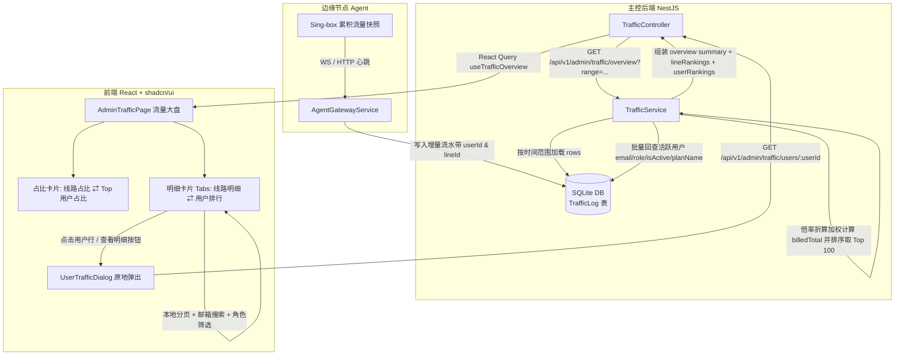

# 管理端流量统计大盘新增用户侧统计与排行实施规划与任务指南

## 🎯 目标与背景

当前系统的全站流量大盘（`/admin/traffic`）已支持网络实时吞吐速率、时序上传/下载双色走势、线路消耗占比环形图及线路消耗明细表。然而，对于全站高用量用户的整体消耗格局、大客户用量集中度以及直接从流量大盘定位并下钻分析单用户的能力尚不完备：

1. **用户流量排行与明细表（User Traffic Rankings & Breakdown）**：
   - 在流量统计大盘底部的「消耗明细」卡片中引入 Tabs 维度切换，支持「按线路明细」与「按用户排行」双重视角。
   - 展示选定时间周期（今日、最近 24 小时、最近 7 天、最近 30 天）内产生流量的活跃用户排行（Top 100），列出上行流量、下行流量、物理总量、倍率加权后的折算计费量及全站占比。
   - 提供邮箱模糊搜索与角色筛选，配备前三名奖牌徽标（🥇🥈🥉）、嵌入式迷你进度条与本地轻量分页。
2. **Top 用户用量占比环形图（Top User Traffic Distribution Donut Chart）**：
   - 在中部右侧的占比卡片中增加微型切换控件，支持在「按线路分布」与「按用户分布（Top 5 用户 + 其他）」间灵活切换。
   - 直观反映全站流量是否过度向个别超级用户倾斜，提供清晰的流量消耗健康度洞察。
3. **单用户画像原地深度下钻（Seamless User Traffic Deep-Dive）**：
   - 点击用户排行表格中的任意用户行或「流量明细」操作按钮，直接原地呼出 `UserTrafficDialog` 宽屏弹窗（含配额画像、小时/天级别平滑走势与该用户的各线路消耗清单），无需脱离流量大盘。
4. **轻量高效后端聚合架构（High-Performance Aggregation）**：
   - 充分复用 SQLite `TrafficLog` 原生时序索引（`[recordedAt, userId]`），在现有 `GET /api/v1/admin/traffic/overview` 请求中完成单次查询同时聚合线路与用户数据。
   - 内存级 Map 归并用户增量流水并乘各线路倍率加权，批量关联用户邮箱与订阅套餐信息，毫秒级响应。

---

## 🏗️ 架构设计与端到端数据流



---

## ⚙️ 数据结构与 API 契约定义

### 1. DTO 类型定义 (`apps/server/src/traffic/dto/traffic.dto.ts`)

```typescript
export interface UserTrafficRankItem {
  userId: string;
  email: string;
  role: string;
  isActive: boolean;
  planName: string | null;
  upload: number;         // 周期内原始上行字节数
  download: number;       // 周期内原始下行字节数
  total: number;          // 周期内物理总字节数 (upload + download)
  billedTotal: number;    // 经各线路倍率折算后的总计费字节数
  percentage: number;     // 占全站选定周期总物理流量百分比 (0~100)
}

export interface TrafficOverviewResponse {
  timeRange: TrafficTimeRange;
  bucketType: TrafficBucketType;
  summary: {
    totalUpload: number;
    totalDownload: number;
    totalPhysical: number;
    totalBilled: number;
    activeLinesCount: number;
    totalLinesCount: number;
    activeUsersCount: number;
    totalUsersCount: number;
  };
  timeSeries: TrafficTimeSeriesPoint[];
  lineRankings: LineTrafficRankItem[];
  userRankings: UserTrafficRankItem[]; // 新增：全站活跃用户流量排行
  rate: { ... };
  rateSeries: Array<{ ... }>;
}
```

### 2. 用户倍率加权与聚合算法说明

在 `TrafficService.aggregate` 执行时：
1. **流水扫描**：每条 `TrafficRow` 包含 `userId`、`lineId`、`upload`、`download`。
2. **线路倍率解析**：优先取日志自带 `line.trafficRate`；若为空，按节点匹配回退活跃线路倍率；均无则默认为 `1.0x`。
3. **用户统计累加**：
   - `userPhysicalTotal = userUpload + userDownload`
   - `userBilledTotal += (rowUpload + rowDownload) * rate`
4. **批量信息回填**：收集所有产生流量的 `userId` 集合，执行一次 `prisma.user.findMany` 批量提取 `email`、`role`、`isActive` 及其当前激活的 `subscription.plan.name`。
5. **百分比与截断**：
   - `percentage = totalPhysical > 0 ? (userPhysicalTotal / totalPhysical) * 100 : 0`（保留 2 位小数）
   - 按 `userPhysicalTotal` 降序排列，截取 Top 100 输出。

---

## 🎨 前端 UI 与交互规范

严格遵循 [docs/FRONTEND_UI_GUIDELINES.md](../FRONTEND_UI_GUIDELINES.md) 与 shadcn/ui 规范：

### 1. 布局结构与交互流

```
+-----------------------------------------------------------------------------------+
|  页面头部: 流量统计                                    [今日] [24h] [7d] [30d] (Tabs) |
+-----------------------------------------------------------------------------------+
|  KPI 指标卡 (总计费 / 总下行 / 总上行 / 下行速率 / 上行速率 / 活跃线路 / 活跃用户)     |
+-----------------------------------------------------------------------------------+
|  历史速率走势图 (RateTrendChart)                                                   |
+-----------------------------------------------------------------------------------+
|  [ 时序吞吐走势 (AreaChart) ]          | [ 消耗占比 (DonutChart)                 ]  |
|  - 原始上行与下行时序堆叠折线          |   卡片头切换: (·) 线路占比  ( ) 用户占比  |
|                                        |   用户占比时展示: Top 1~5 用户 + 其他    |
+-----------------------------------------------------------------------------------+
|  [ 消耗明细与排行榜 (Card)                                                       ]  |
|  卡片头部: [ 线路明细 ]  [ 用户排行 ] (Tabs)                                      |
|  - 处于「用户排行」时：                                                            |
|    [ 🔍 搜索用户邮箱... ]    [ 角色筛选: 全部/管理员/用户 ▾ ]                         |
|  -------------------------------------------------------------------------------- |
|  #   用户 (邮箱+角色+套餐)       上行流量    下行流量    物理总量    折算计费量  占比   操作 |
|  🥇  alice@example.com (专业版) 12.5 GiB    85.2 GiB    97.7 GiB   146.5 GiB  42.5% [明细] |
|  🥈  bob@example.com   (基础版)  4.1 GiB    28.3 GiB    32.4 GiB    32.4 GiB  14.1% [明细] |
|  🥉  charlie@test.org  (免费版)  1.2 GiB     8.5 GiB     9.7 GiB     9.7 GiB   4.2% [明细] |
|  - 分页控件: 第 1/5 页, 每页 10 条                                                |
+-----------------------------------------------------------------------------------+
```

### 2. 交互细节
- **行点击与操作按钮**：点击表格行或右侧操作栏的「流量明细」按钮，触发 `onSelectUser(user)`，原地唤出 `UserTrafficDialog`。
- **占比环形图自适应**：切到「用户占比」时，图例展示前 5 大用户的脱敏/截断邮箱与百分比，其余归纳为“其他用户”，中心标签动态计算。

---

## 📋 里程碑与任务清单

### 里程碑 1：后端 DTO 契约扩展与高效聚合逻辑实现
- [x] 1.1 在 `apps/server/src/traffic/dto/traffic.dto.ts` 中定义 `UserTrafficRankItem` 接口，并在 `TrafficOverviewResponse` 中增加 `userRankings` 字段
- [x] 1.2 在 `apps/server/src/traffic/traffic.service.ts` 中实现用户维度的流水分组聚合，完成倍率加权计费折算与全站物理占比计算
- [x] 1.3 批量关联用户的 `email`、`role`、`isActive` 及订阅套餐名称 `planName`，按用量倒序排序并截取 Top 100
- [x] 1.4 在 `apps/server/src/traffic/traffic.service.spec.ts` 中补充针对 `userRankings` 的多用户测试用例，覆盖空数据、多倍率折算及百分比计算

### 里程碑 2：前端组件开发与大盘交互闭环
- [x] 2.1 在 `apps/web/src/pages/admin/traffic/use-traffic.ts` 中导出 `UserTrafficRankItem` 类型并适配 `useTrafficOverview`
- [x] 2.2 开发 `apps/web/src/pages/admin/traffic/components/user-rank-table.tsx` 用户排行表格组件，支持邮箱模糊搜索、角色筛选、前三名奖牌徽章、进度条与本地轻量分页
- [x] 2.3 改造 `apps/web/src/pages/admin/traffic/components/traffic-charts.tsx` 中的 `TrafficDonutChart`，支持接收用户排行数据并呈现 Top 5 + 其他用户占比
- [x] 2.4 改造 `apps/web/src/pages/admin/traffic/index.tsx`：
  - 在中部占比卡片中增加「线路占比 / 用户占比」微型切换
  - 在底部消耗明细卡片中增加「线路明细 / 用户排行」Tabs 切换
  - 引入并挂载 `UserTrafficDialog` 弹窗，点击任意用户行或操作按钮原地弹出下钻视图

### 里程碑 3：文档同步与五合一质量门禁
- [x] 3.1 更新接口协议文档 `docs/API_AND_PROTOCOLS.md`，记录 `GET /api/v1/admin/traffic/overview` 新增的 `userRankings` 字段
- [x] 3.2 更新前端规范文档 `docs/FRONTEND_UI_GUIDELINES.md` 与 `docs/VISUAL_VERIFICATION.md`，记录流量统计大盘的用户侧 UI 组件与交互
- [x] 3.3 在 `CHANGELOG.md` 顶部的 `## [Unreleased]` 缓冲区中记录本次管理端流量统计用户维度新增条目
- [x] 3.4 运行全局五合一质量门禁 `pnpm gate`（version + docs + server + web + agent），确保全绿通过

---

## 🧪 验收标准与测试记录

- [x] 后端单元测试 `traffic.service.spec.ts` 100% 通过且无回归。
- [x] 管理员访问 `/admin/traffic`，在「消耗明细」卡片中点击「用户排行」选项卡，可正常查看全站用户用量排行。
- [x] 搜索框输入邮箱关键词可实时模糊过滤，角色下拉菜单可筛选管理员/普通用户。
- [x] 点击用户排行行或「查看明细」按钮，可原地弹出 `UserTrafficDialog`，正确呈现该用户的配额与时序明细。
- [x] 中部占比卡片可自由切换「线路占比」与「用户占比」，图例与扇区占比计算准确无重影。
- [x] 切换时间范围（今日、24h、7d、30d）时，用户排行与环形图平滑重查且无闪烁。
- [x] 全局五合一门禁 `pnpm gate` 全部绿灯。
