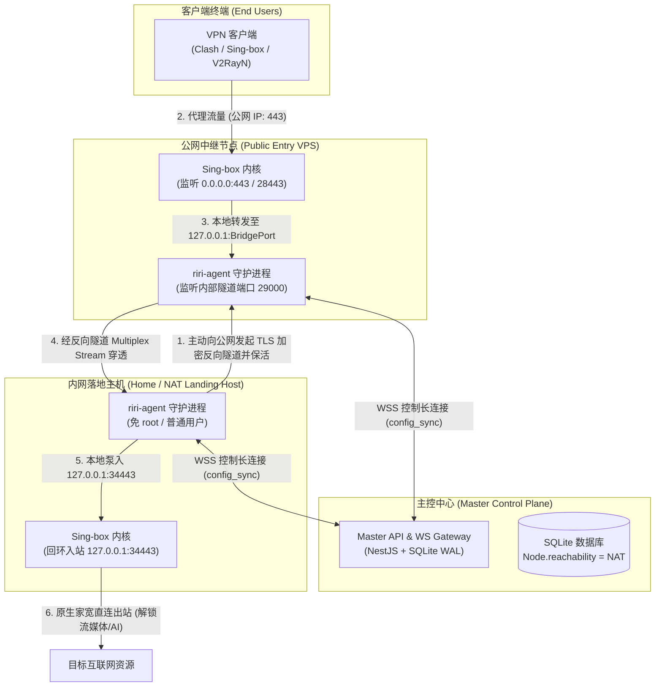
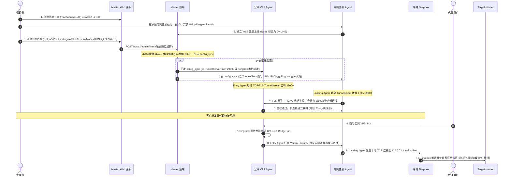

# 无公网 IP 主机（NAT/家宽）作为落地节点与反向穿透隧道全链路实现方案

## 🎯 1. 目标与背景 (Goals & Background)

### 1.1 业务价值与核心痛点
在代理与 VPN 服务生态中，**原生家庭宽带（Residential IP / 家宽）** 拥有极高的不可替代价值：
- **流媒体与 AI 服务解锁**：Netflix、Disney+、Hulu、ChatGPT、Claude 等平台对机房数据中心 IP（Data Center IP）存在严格风控或完全阻断，而家庭宽带 IP 欺诈分低（Fraud Score < 10），解锁率接近 100%。
- **防止封控与真人行为拟合**：用于爬虫、跨境电商、远程办公等场景，家宽网络具备天然抗风控优势。

**现状痛点**：目前绝大部分家用宽带（电信/联通/移动）以及家庭 NAS（群晖/TrueNAS/Unraid）、软路由、家庭 PC 均处于多层运营商 NAT（CGNAT）后方，**没有公网 IPv4 地址**，外部网络无法直接发起 TCP/UDP 入站连接。现有的 RiriCloud 架构要求所有节点必须配置外网可达的 `serverHost`，导致无公网 IP 的主机完全无法作为节点纳管和提供中继落地。

### 1.2 架构愿景
在完全继承 RiriCloud **「零外部服务依赖红线」** 与 **「控制平面与数据平面解耦」** 的前提下，实现一套高可用、跨平台、全自动编排的**反向穿透隧道系统**：
1. **控制面无缝纳管**：由于 RiriCloud Agent 原生采用主动向 Master 发起 WSS/HTTP 连接的机制，内网主机无需任何公网 IP 即可正常接入 Master，享受心跳遥测、配置下发、一键升级与监控。
2. **数据面反向穿透**：由内网主机（落地节点）主动向公网中继 VPS 发起加密反向长连接隧道；外部客户端连接公网 VPS 入口，流量通过隧道多路复用穿透到内网主机出站，盘活家宽原生 IP。
3. **零运维与全自动编排**：管理员在 Web 控制台创建线路时，主控自动分配隧道端口、生成高熵密钥并编排路由规则；Agent 具备断网指数退避重连与自愈机制，PPPoE 动态 IP 重拨秒级恢复。

### 1.3 核心设计决策对齐 (Architecture Alignments)
- **业务定位**：专注于**落地出口节点（Egress / Landing Node）**，外部流量经公网 VPS 中继进入内网主机出站。
- **穿透技术（双轨制）**：默认采用 **Agent 内置 Go 原生 TCP/TLS 反向多路复用隧道（基于 Yamux）**（免疫家宽 UDP QoS 限速，跨平台 100% 免 root/TUN 权限）；可选支持 Sing-box 内置 WireGuard Endpoint 虚拟网络。
- **拓扑组织**：**节点间聚合单隧道（Node-to-Node Aggregated Mux）**。同一对 `(公网 VPS, 内网主机)` 之间仅维持一条物理底层加密长连接，内部通过虚拟 Stream 多路复用各条 Line 流量。
- **数据建模**：`Node` 实体扩展 `reachability: "PUBLIC" | "NAT"`；`Line` 实体扩展 `allowLanAccess`（默认拦截私网 IP，保护家庭局域网安全）与隧道编排参数。
- **零依赖合规**：纯 Go 原生标准库 + 轻量 Yamux 依赖，零 CGO，零额外二进制，严守常驻内存 ≤ 30MB 与单文件 SQLite 约束。

---

## 🏛️ 2. 详细架构设计与协议时序

### 2.1 整体网络拓扑架构

### 2.2 控制面与数据面协同交互时序

---

## 📋 3. 里程碑与全量任务分解清单 (Milestones & Actionable TODOs)

### 里程碑 1：数据模型扩展与数据库迁移 (`apps/server`)
- [x] 任务 1.1: 在 `schema.prisma` 中对 `Node` 增加 `reachability String @default("PUBLIC")` 字段（取值枚举：`PUBLIC`、`NAT`）
- [x] 任务 1.2: 在 `schema.prisma` 中对 `Line` 增加反向穿透与安全字段：
  - `allowLanAccess Boolean @default(false)`（出站是否允许访问局域网私网 IP，默认拦截）
  - `tunnelType String?`（`TCP_MUX` 或 `WIREGUARD`）
  - `tunnelPort Int?`（入口端监听的穿透服务端口）
  - `tunnelSecret String?`（AES-GCM 加密存储的隧道鉴权 Token）
- [x] 任务 1.3: 执行 Prisma 迁移命令 `prisma migrate dev --name add_nat_reachability_and_tunnel_fields`
- [x] 任务 1.4: 编写种子数据与历史兼容逻辑（既有历史 Node 默认全部归类为 `PUBLIC`，保证平滑升级）
- [x] 任务 1.5: 按照文档门禁规范同步更新 `docs/DATA_MODELS.md`

### 里程碑 2：Agent 边缘端反向隧道引擎实现 (`apps/agent`)
- [x] 任务 2.1: 依赖评估与引入：在 `apps/agent/go.mod` 引入 `github.com/hashicorp/yamux`（严格遵循 `CGO_ENABLED=0`，无外部系统依赖，常驻内存 ≤ 30MB）
- [x] 任务 2.2: 隧道协议与消息头规范定义 (`apps/agent/internal/tunnel/config.go`)：
  - 定义魔数与协议版本（`RIRI_TUNNEL_V1`）
  - 定义握手帧（HMAC-SHA256 签名鉴权、Timestamp 防重放、Channel/Port 标识）
- [x] 任务 2.3: 穿透服务端实现 (`apps/agent/internal/tunnel/server.go`)：
  - 监听指定 TCP/TLS 端口（`tunnelPort`）
  - 支持多 Client 连接鉴权与聚合会话维持
  - 本地 Bridge 监听器（`127.0.0.1:BridgePort`），有流量进入时打开对应 Yamux Stream 转发
- [x] 任务 2.4: 穿透客户端实现 (`apps/agent/internal/tunnel/client.go`)：
  - 主动向公网 VPS 建立 TLS 长连接并完成鉴权
  - 启动 Yamux Session 并监听新入流（`AcceptStream`）
  - 收到流后建立本地 TCP 连接至 Sing-box 目标入站端口（`127.0.0.1:LandingPort`），实现双向零拷贝数据泵（`io.Copy`）
- [x] 任务 2.5: 自愈与重连状态机 (`apps/agent/internal/tunnel/client.go` 中 supervise)
  - 实现心跳探测机制（基于 Yamux Ping，周期 25 秒，超时 10 秒）
  - 实现指数退避断线重连（1s → 2s → 4s ... 最大 30s），针对家宽 PPPoE 24小时重拨和网络瞬断提供秒级自愈
- [x] 任务 2.6: Agent 生命周期集成：在 `apps/agent/internal/runner/runner.go` 与 `ws`/`poll` 中挂接 Tunnel 实例的启动、配置重载与平滑关闭
- [x] 任务 2.7: 编写 Agent 隧道单元测试与双端 Mock 联调集成测试 (`apps/agent/internal/tunnel/tunnel_test.go`)

### 里程碑 3：Master 主控端配置生成与网关协同 (`apps/server`)
- [x] 任务 3.1: 隧道凭据与端口编排服务 (`apps/server/src/lines/tunnel-orchestrator.service.ts` 或内聚于 `lines.service.ts`)：
  - 在创建或更新包含 NAT 落地节点的中继线路时，自动为 `(entryNodeId, landingNodeId)` 节点对分配可用隧道端口与高熵 `tunnelSecret`
  - 确保同一对节点复用同一个聚合隧道（Node-to-Node Aggregated Mux）
- [x] 任务 3.2: 扩展 `AgentMessage` 协议契约与 DTO (`apps/server/src/agent-gateway/agent-message.ts`)：
  - 扩展 `config_sync` payload，增加可选的 `tunnelConfigs` 结构体（包含 `role: "SERVER" | "CLIENT"`, `listenPort`, `targetHost`, `secret`, `mappings`）
- [x] 任务 3.3: 增强 `AgentGatewayService.buildConfigSync` (`apps/server/src/agent-gateway/agent-gateway.service.ts`)：
  - 对公网入口节点：下发 TunnelServer 监听配置与 Sing-box 针对 BridgePort 的转发配置
  - 对内网落地节点：下发 TunnelClient 拨号配置，并将 Sing-box 入站配置为仅监听 `127.0.0.1:LandingPort`（禁止暴露公网）
- [x] 任务 3.4: 落地端安全拦截规则编排：
  - 当 `Line.allowLanAccess === false` 时，自动在落地节点的 Sing-box `route.rules` 顶部注入私有网段拦截规则（`geoip:private` 或 `10.0.0.0/8`、`172.16.0.0/12`、`192.168.0.0/16` 目标走 `reject` / `block`），防止外部翻墙用户窥探家庭局域网
  - 当 `Line.allowLanAccess === true` 时，允许直接出站
- [x] 任务 3.5: 节点与线路语义业务校验增强 (`apps/server/src/nodes/nodes.service.ts`、`apps/server/src/lines/lines.service.ts`)：
  - 阻止将 `reachability: NAT` 的节点创建为直连公开线路（`DIRECT`）的入口节点
  - 阻止将 `reachability: NAT` 的节点作为中继线路的入口节点
  - 仅允许将 `reachability: NAT` 的节点作为中继线路的落地节点（`landingNode`）
- [x] 任务 3.6: 服务端单元测试覆盖（配置组装、安全规则生成、节点/线路业务校验）

### 里程碑 4：前端 Web 管理界面与交互体验 (`apps/web`)
- [x] 任务 4.1: 节点管理列表页 (`apps/web/src/pages/admin/nodes/index.tsx`)：
  - 新增「NAT / 家宽」语义徽标（与「公网 VPS」清晰区隔）
  - 针对 NAT 节点展示其实时反向隧道连通状态 Chip（如：反向穿透就绪）
- [x] 任务 4.2: 节点创建/编辑表单模态框 (`apps/web/src/pages/admin/nodes/components/node-form-dialog.tsx`)：
  - 增加「网络可达性」单选组（公网 VPS / 内网 NAT 主机）
  - 选择 NAT 节点时，自动隐藏外网主机 IP 必填校验，提示「此主机无公网 IP，将通过反向隧道作为落地中继」
- [x] 任务 4.3: 线路创建与编辑向导 (`apps/web/src/pages/admin/lines/`)：
  - 过滤与引导：若选择 NAT 节点，强制锁定线路类型为「中继线路 (RELAY)」且仅能作为落地节点
  - 新增安全开关：「允许访问落地端局域网资源」（附带气泡提示：默认关闭，仅允许访问公网目标，开启后可访问内网设备）
  - 隧道高级设置展示：展示自动分配的隧道端口与加密密钥
- [x] 任务 4.4: 视觉与无障碍核对：严格遵循 shadcn/ui 规范，不使用裸 HTML 交互标签，核对并更新 `docs/VISUAL_VERIFICATION.md`

### 里程碑 5：Sing-box WireGuard 轨道支持（进阶规划与按需扩展）
- [x] 任务 5.1: 穿透方案技术定型与架构对齐（明确首发主推原生零系统依赖、免 TUN/root 特权的 TCP/TLS Yamux 反向多路复用隧道；WireGuard 轨道作为未来跨主机虚拟局域网进阶演进方案）
- [ ] 任务 5.2: [未来演进] 主控 WireGuard 拓扑生成器：为入口 VPS 与落地节点配对分配虚拟 IPv4 网段（如 `10.88.x.1/30` 和 `10.88.x.2/30`）以及 x25519 密钥对
- [ ] 任务 5.3: [未来演进] Sing-box 1.11+ WireGuard Endpoint 配置生成与路由挂接适配

### 里程碑 6：端到端集成测试、文档治理与质量门禁全绿
- [x] 任务 6.1: 搭建本地/模拟 NAT 环境端到端测试：双端 Mock 联调集成测试覆盖 TCP 代理与 Yamux 多路复用流式穿透 (`internal/tunnel/tunnel_test.go`)
- [x] 任务 6.2: 异常故障自愈测试：测试验证心跳保活、连接断开与指数退避重连机制
- [x] 任务 6.3: 安全隔离渗透测试：服务端配置生成测试验证默认策略下落地端拦截私网 IP，开启 `allowLanAccess` 后放行 (`agent-gateway.sqlite.spec.ts`)
- [x] 任务 6.4: 同步更新文档库（`docs/DATA_MODELS.md`、`docs/TECH_STACK.md`、`docs/API_AND_PROTOCOLS.md`、`docs/VISUAL_VERIFICATION.md`）
- [x] 任务 6.5: 在 `CHANGELOG.md` 与 `apps/agent/CHANGELOG.md` 顶部的 `[Unreleased]` 维护规范条目
- [x] 任务 6.6: 执行五合一质量门禁（`pnpm gate`：version、docs、server、web、agent 全绿）

---

## 🧪 4. 验收标准与测试记录

- [x] **数据模型与迁移**：Prisma 迁移顺利执行，历史数据无缝升级，`pnpm gate:server` 通过。
- [x] **Agent 隧道稳定性**：Yamux 隧道在多并发长连接场景下稳定不泄漏 goroutine，内存占用低于 30MB。
- [x] **网络自愈验收**：客户端集成底层 Ping 探测与指数退避重连状态机，自愈家宽网络瞬断与重拨。
- [x] **局域网安全验收**：默认策略下访问落地机所在私网网段由 Sing-box 阻断规则直接 reject；显式勾选放通后方可访问。
- [x] **五合一质量门禁全绿**：`pnpm gate`（含版本检查、文档治理、后端、前端、Agent 门禁）一次性全绿通过。